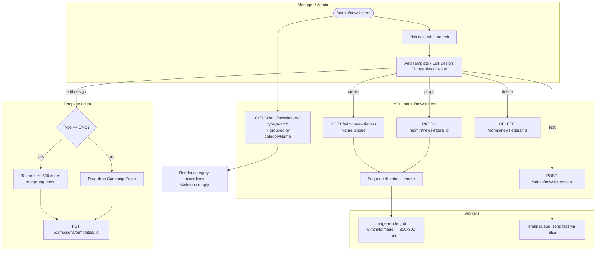
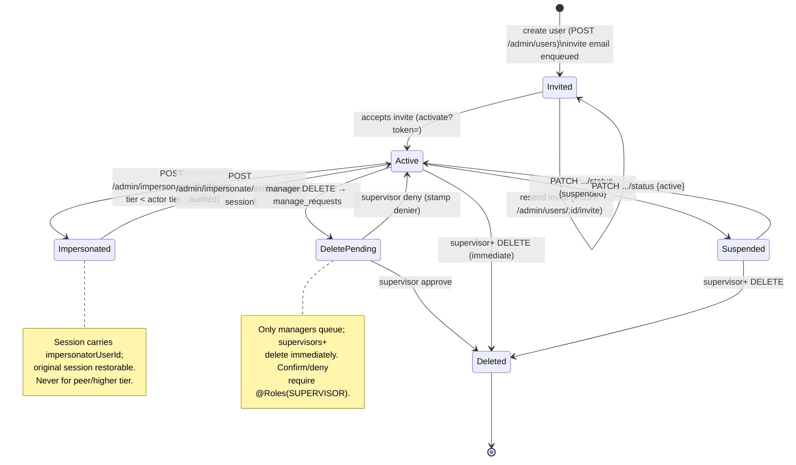

# Manage / Admin — Activity / Flow Diagrams

Mermaid flow + state diagrams for the admin domain. They render natively in GitHub and VSCode
(Mermaid preview). Actor "lanes" are modelled with subgraphs (Admin/Manager / Web / API / Worker /
Integration).

Pairs with [user-stories.md](./user-stories.md) and the spec at
[`../feature-spec/manage-admin.md`](../feature-spec/manage-admin.md).

Index:
1. [Admin lists accounts (gate + scope)](#1-admin-lists-accounts-us-a11a12)
2. [Impersonate / assume a profile](#2-impersonate--assume-a-profile-us-a21)
3. [Create / suspend / delete an account](#3-create--suspend--delete-an-account-us-a32-a36)
4. [Manage shared templates](#4-manage-shared-templates-us-a61)
5. [Adjust limits & permissions (toll-free + roles)](#5-adjust-limits--permissions-us-a42-a32)
6. [Deletion-request queue](#6-deletion-request-queue-us-a51)
7. [RBAC / role state machine](#7-rbac--role-state-machine)

---

## 1. Admin lists accounts (US-A1.1–A1.2)

```mermaid
flowchart TD
    subgraph Actor[Manager / Admin]
        A([Open /admin]) --> B[Type search / pick status filter]
    end
    subgraph Web
        A --> W[Mount admin console\nread params from URL]
        B -->|debounced, page→1| C
        W --> C[GET /admin/stats\n+ GET /admin/profiles?query,status[],dates[],page]
    end
    subgraph API[API · admin module]
        C --> G{TenantGuard:\naccountType >= ACCOUNT_MANAGER?}
        G -- no --> X[[403 → redirect /dashboard]]
        G -- yes --> S[Lift profile tenant scope\nbound rows to caller tier]
        S --> Q{query / status / dates?}
        Q -- yes --> F[Apply LIKE + status subset\n+ createdAt window]
        Q -- no --> H[All in admin scope]
        F --> P
        H --> P[Join review/contact counts\n(read model, not N+1)]
        P --> O[Offset paginate perPage 10]
        O --> R[[stats + data[], page, total, pages]]
    end
    R --> V[Render KPI cards + Accounts table\nskeleton / empty / rows]
```

---

## 2. Impersonate / assume a profile (US-A2.1)

```mermaid
flowchart TD
    subgraph Actor[Manager / Admin]
        A([Open row Actions menu]) --> B{Target tier < my tier?}
        B -- no --> C[Impersonate hidden / disabled]
        B -- yes --> D[Click Impersonate → confirm]
    end
    subgraph API[API · admin module]
        D --> E[POST /admin/impersonate/:id]
        E --> F{Re-check: caller >= ACCOUNT_MANAGER\nAND target tier < caller tier?}
        F -- no --> Z[[403 · no session change]]
        F -- yes --> G[Write audit row\nactor, target user/profile, ts]
        G --> H[Issue impersonation session\nimpersonatorUserId + target profileId]
        H --> I[[200 + swapped token]]
    end
    I --> J([Banner: 'Viewing as {account}'\n+ Exit impersonation])
    J --> K[Click Exit] --> L[POST /admin/impersonate/exit]
    L --> M[Restore original session\nwrite audit 'exit']
    M --> N([Back to /admin as myself])
    Z -.-> A
```

> Fix-on-rebuild: impersonation is under the admin group, tier-bounded, and **audited** — none of
> which v1 enforced.

---

## 3. Create / suspend / delete an account (US-A3.2, A3.4, A3.6)

```mermaid
flowchart TD
    subgraph Actor[Manager / Admin]
        A([/admin/users → Add New User]) --> B[Fill form:\nname, email, role, profiles[], permissions[]]
        B --> C[Submit]
        S0([Row action: Suspend / Activate]) --> S1
        D0([Row action: Delete]) --> D1[Confirm modal]
    end
    subgraph API[API · admin/users]
        C --> V{Valid?\nrole in_list AND role tier <= my tier}
        V -- no --> E[[422 / 403 field errors]]
        V -- yes --> W[Insert user\nrole + scoped permissions]
        W --> M[Enqueue invitation email\nemail queue · activation token]
        M --> N[[201 created]]

        S1[PATCH /admin/users/:id/status\n{status: active|suspended}] --> S2[Set explicit status]
        S2 --> S3[[200 · badge updates]]

        D1 --> D2[DELETE /admin/users/:id]
        D2 --> D3{Caller tier?}
        D3 -- manager --> D4[Create manage_requests row\nstatus = pending]
        D3 -- supervisor+ --> D5[Hard-delete immediately]
        D4 --> D6[[Request created]]
        D5 --> D7[[Deleted]]
    end
    subgraph Worker[Worker · email queue]
        M --> J[Render + send invite via SES\nactivate?token= link]
    end
    N --> R([Redirect /admin/users + toast])
```

> Fix-on-rebuild: update is `PATCH` (not v1 `POST`); status is explicit (not a blind toggle);
> permission vocabulary unified to one typed enum.

---

## 4. Manage shared templates (US-A6.1)



> Fix-on-rebuild: FCM + wkhtmltoimage move to queues (v1 ran them inline);
> `NewsletterCategory::delete` returns a proper status.

---

## 5. Adjust limits & permissions (US-A4.2, A3.2)

```mermaid
flowchart TD
    subgraph Actor[Manager / Admin]
        A([/admin/profiles/:id]) --> B[Edit details / toll-free panel]
        R([Edit user]) --> RP[Toggle role + permissions[]]
    end
    subgraph API[API · admin/profiles + users]
        B -->|save details| PD[PATCH /admin/profiles/:id\nName, slug, expiry]

        B -->|eligibility| EL[POST .../tollfree/eligibility {enabled}]
        EL --> ELc{enabled = true?}
        ELc -- no --> ELx[Cannot assign numbers]
        ELc -- yes --> AS[POST .../tollfree/assign-number\n{tollfreeNumberId}]
        AS --> ASc{number in reserved|released\nAND no active number held?}
        ASc -- no --> ASx[[409 conflict]]
        ASc -- yes --> ACT[POST .../tollfree/activate-sender]
        ACT --> POL{TollfreeSenderActivationPolicy\n.canActivate?}
        POL -- no --> POLx[[Blocked: reason\nassigned_number_required / approved_verification_required\n/ inbound_routing_unavailable / pilot_scope_not_supported]]
        POL -- yes --> SAo[sender_mode = active]

        RP --> RPv{New role tier <= my tier?}
        RPv -- no --> RPx[[403]]
        RPv -- yes --> RPok[PATCH /admin/users/:id\nrole + scoped permissions]
    end
    subgraph Audit
        AS --> AU[Write twilio_tollfree_verification_event\nidempotency key + actor id · UTC]
        ACT --> AU
        EL --> AU
    end
    subgraph Integration[Twilio]
        SAo --> TW[Provision / activate toll-free sender]
    end
```

---

## 6. Deletion-request queue (US-A5.1)

```mermaid
flowchart TD
    subgraph Manager
        A([Delete user/profile]) --> B[manage_requests row\nstatus = pending]
    end
    subgraph Supervisor
        B --> C([Open /admin/manage-requests])
        C --> D[Users / Profiles tab\n+ select rows]
        D --> E{Action}
        E -->|Confirm| F[POST .../:id/approve\n(or reuse delete path)]
        E -->|Deny| G[POST .../:id/deny]
    end
    subgraph API
        F --> Fg{caller >= SUPERVISOR?}
        Fg -- no --> Fx[[403]]
        Fg -- yes --> Fok[Execute deletion\nmark request approved]
        G --> Gg{caller >= SUPERVISOR?}
        Gg -- no --> Gx[[403]]
        Gg -- yes --> Gok[Reject request\nstamp denier user id]
    end
    Fok --> R([Refresh queue + counts])
    Gok --> R
```

---

## 7. RBAC / role state machine

How a user's effective role/state moves under admin action. Tier bounds gate every transition
(an actor may only move a subject **at or below** their own tier).



> Role-assignment rule (orthogonal to the state above): the **role tier** a user may be granted is
> capped at the actor's own tier — only `OGGVO_ADMIN` may create or promote to `Admin`. Permissions
> apply only to non-Admin roles (Admin = full access).
