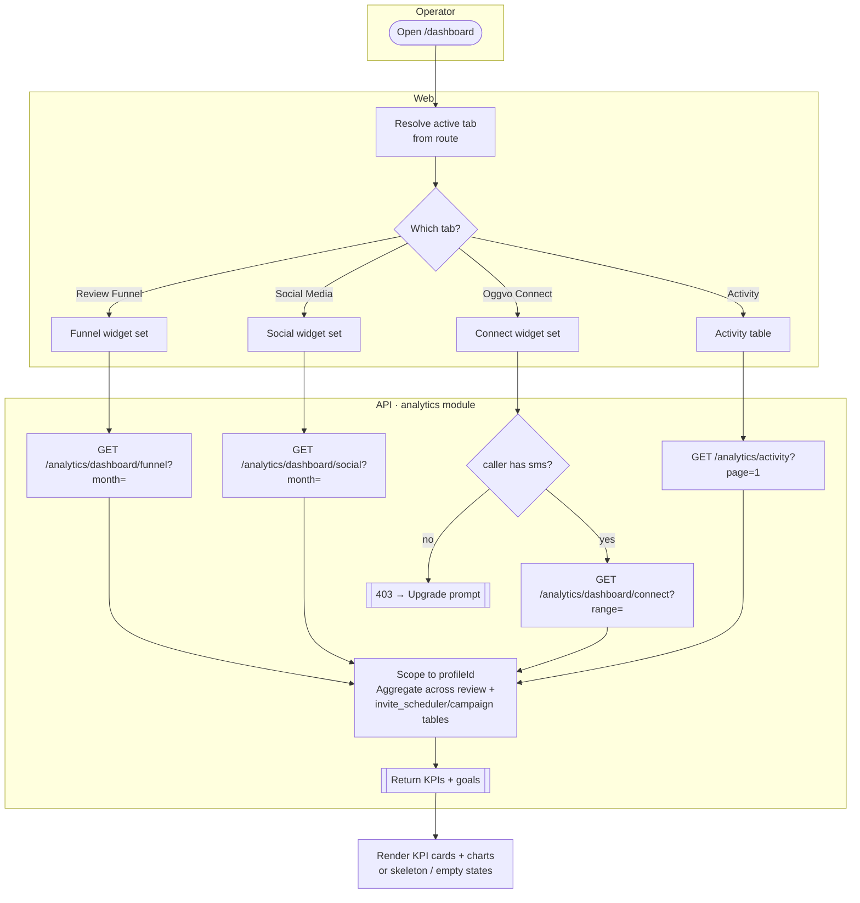
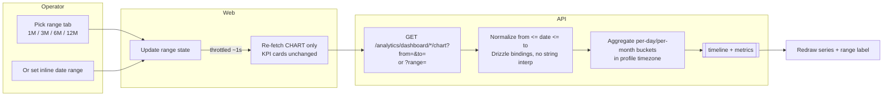
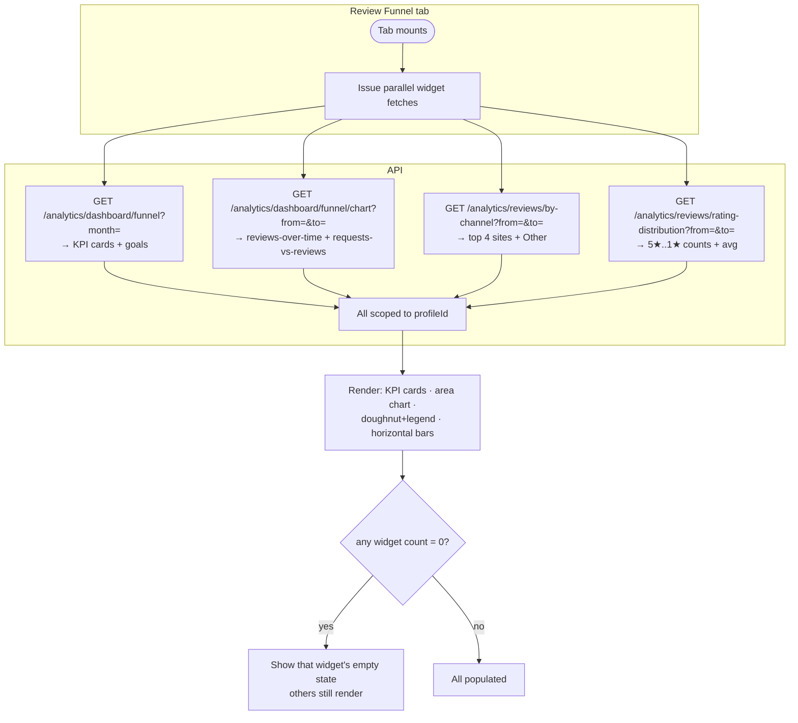
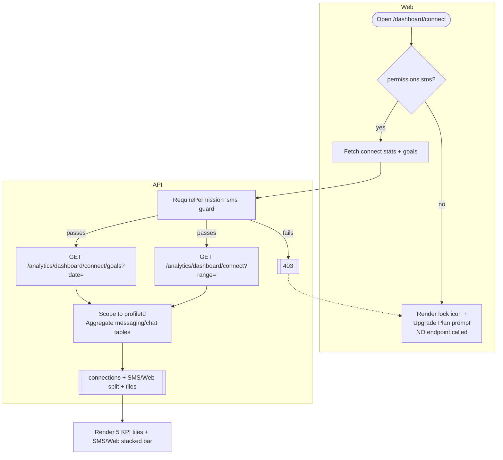

# Analytics & Dashboard — Activity / Flow Diagrams

Mermaid flow diagrams for the analytics & dashboard domain. They render natively in GitHub and VSCode
(Mermaid preview). Actor "lanes" are modelled with subgraphs (Operator / Web / API / Ingestion).

Pairs with [user-stories.md](./user-stories.md) and the spec at
[`../feature-spec/analytics-dashboard.md`](../feature-spec/analytics-dashboard.md).

Index:
1. [Dashboard load + tab aggregation](#1-dashboard-load--tab-aggregation-us-11-21-31)
2. [Date-range refresh (chart only)](#2-date-range-refresh-chart-only-us-12-22)
3. [Per-widget data fetch (funnel tab fan-out)](#3-per-widget-data-fetch-funnel-tab-fan-out-us-11-14)
4. [Connect tab permission gate](#4-connect-tab-permission-gate-us-31)
5. [Modify goals (targets upsert)](#5-modify-goals-targets-upsert-us-52)
6. [Activity log drill-down](#6-activity-log-drill-down-us-41)

---

## 1. Dashboard load + tab aggregation (US-1.1, 2.1, 3.1)



---

## 2. Date-range refresh (chart only) (US-1.2, 2.2)



> Fix-on-rebuild: conventional `from <= date <= to` (v1 inverted), parameterized (v1 interpolated), profile-tz buckets (v1 raw DB dates).

---

## 3. Per-widget data fetch (funnel tab fan-out) (US-1.1–1.4)



> Fix-on-rebuild: v1 fans out independent stats+chart+goals calls per tab (N+1). Consider one consolidated per-tab endpoint in v2.

---

## 4. Connect tab permission gate (US-3.1)



> Fix-on-rebuild: gate is enforced server-side (v1 RBAC was client-only). "AI Used" hardcoded 0% card must be wired or removed.

---

## 5. Modify goals (targets upsert) (US-5.2)

```mermaid
flowchart TD
    subgraph Operator
        A([Click Modify Goals]) --> B[Edit goal quantity inputs\nfor the active tab]
        B --> C[Submit]
    end
    subgraph API[API · monthly-targets]
        C --> D[Scope to profileId\nkey by (profileId, YYYY-MM)]
        D --> E{Row for that month exists?}
        E -- yes --> F[UPDATE row]
        E -- no --> G[INSERT row]
        F --> H[[200 updated — idempotent]]
        G --> H
    end
    H --> I[Emit 'updated' → toast]
    I --> J[Re-fetch active tab stats\n→ progress bars re-measure]
```

---

## 6. Activity log drill-down (US-4.1)

```mermaid
flowchart LR
    subgraph Operator
        A([Open /dashboard/activity])
        S[Type search / pick filters / dates] -->|page→1, throttled ~1s| B
    end
    subgraph Web
        A --> B[GET /analytics/activity?\npage,perpage,from,to,types,names,search]
    end
    subgraph API
        B --> C[Scope to profileId\nServer-side filter + paginate]
        C --> D[Join recipient + campaign + activity\nrender activityDate in profile tz]
        D --> E[[activities[] + meta.pages]]
    end
    E --> F{rows?}
    F -- none --> G[Show 'No Activity Found']
    F -- some --> H[Render rows:\nRecipient · Request Type badge ·\nActivity badges + interactions pill ·\nSchedule · Via]
    H --> I([Click a recipient row])
    I --> J[Drill into recipient detail\n+ full interaction history]
```

> Fix-on-rebuild: consolidate the v1 top-level `/activity` stub and mobile-only `/dashboard/activity-history` static page into this one view; convert `activityDate` UTC→profile-tz via a single tz boundary.
