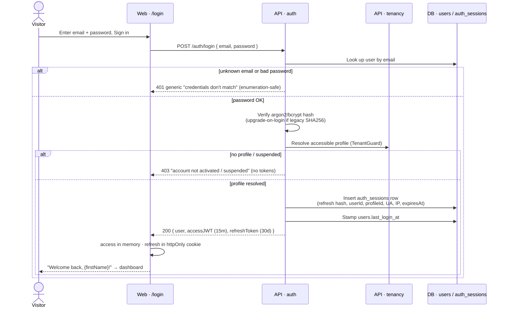
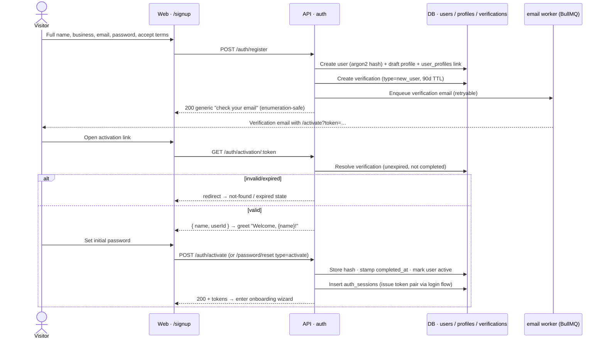
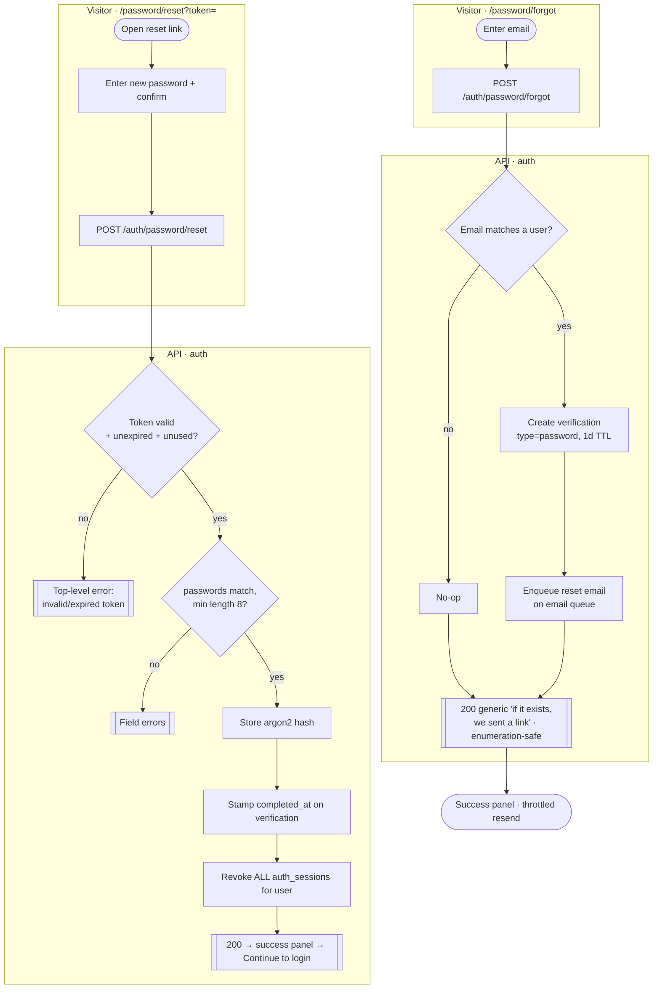
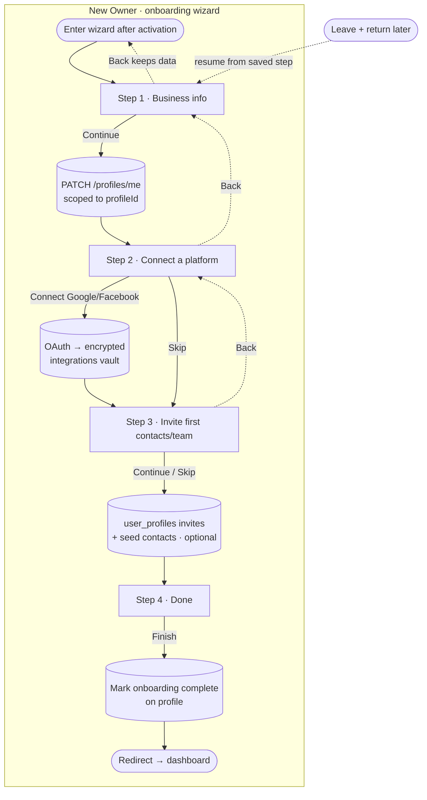
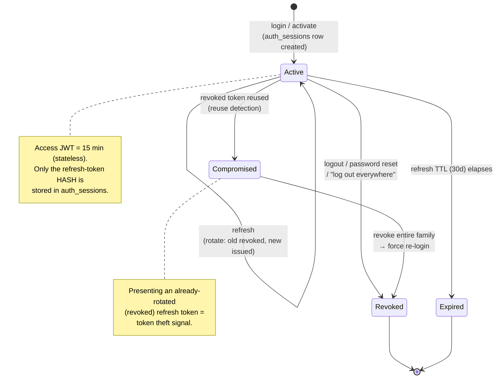

# Auth & Onboarding — Activity / Flow Diagrams

Mermaid flow + sequence diagrams for the auth & onboarding domain. They render natively in GitHub and
VSCode (Mermaid preview). Actor "lanes" are modelled with subgraphs / sequence participants
(Visitor / Web / API · auth / API · tenancy / DB (`auth_sessions`, `verifications`) / `email` worker).

Pairs with [user-stories.md](./user-stories.md) and the spec at
[`../feature-spec/auth-onboarding.md`](../feature-spec/auth-onboarding.md).

Index:
1. [Login + access/refresh issuance](#1-login--accessrefresh-issuance-us-11)
2. [Refresh-token rotation + reuse detection](#2-refresh-token-rotation--reuse-detection-us-12)
3. [Signup → email verification → activation](#3-signup--email-verification--activation-us-21-22)
4. [Forgot / reset password](#4-forgot--reset-password-us-14-15)
5. [Onboarding wizard (resumable)](#5-onboarding-wizard-resumable-us-31-35)
6. [Session lifecycle state machine](#6-session-lifecycle-state-machine)

---

## 1. Login + access/refresh issuance (US-1.1)



---

## 2. Refresh-token rotation + reuse detection (US-1.2)

```mermaid
flowchart TD
    subgraph Web
        A([access JWT near expiry / 401]) --> B[POST /auth/refresh<br/>with refresh cookie]
    end
    subgraph API[API · auth]
        B --> C[Hash presented refresh token]
        C --> D{Matching auth_sessions row?}
        D -- no --> E[[401 — unknown token<br/>reject]]
        D -- yes --> F{Row revoked?}
        F -- yes (already rotated) --> G[REUSE DETECTED:<br/>revoke entire session family]
        G --> H[[401 — force re-login]]
        F -- no --> I{expires_at > now?}
        I -- no --> J[[401 — expired]]
        I -- yes --> K[Revoke presented row<br/>revoked_at = now]
        K --> L[Insert NEW auth_sessions row<br/>+ new refresh token]
        L --> M[Sign new 15-min access JWT]
        M --> N[[200 { accessJWT, refreshToken }]]
    end
    N --> O([Web stores rotated pair, retries request])
```

> Fix-on-rebuild: v1 `/refresh` was unauthenticated and never rotated — any valid refresh token worked
> until expiry. v2 authenticates against `auth_sessions`, rotates on every use, and detects reuse.

---

## 3. Signup → email verification → activation (US-2.1, 2.2)



---

## 4. Forgot / reset password (US-1.4, 1.5)



---

## 5. Onboarding wizard (resumable) (US-3.1–3.5)



> Fix-on-rebuild: each step persists on Continue (resumable across sessions), uploads go through the
> media/S3 pipeline, OAuth tokens land in the AES-GCM vault, and hours use the profile timezone — none of
> which existed in v1's static mockup wizard. All writes are TenantGuard-scoped to the owner's profileId.

---

## 6. Session lifecycle state machine


