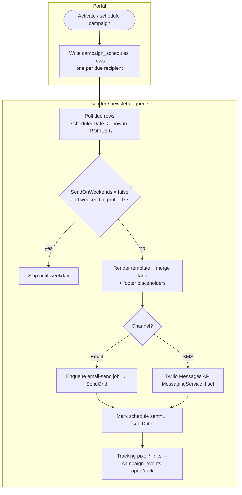
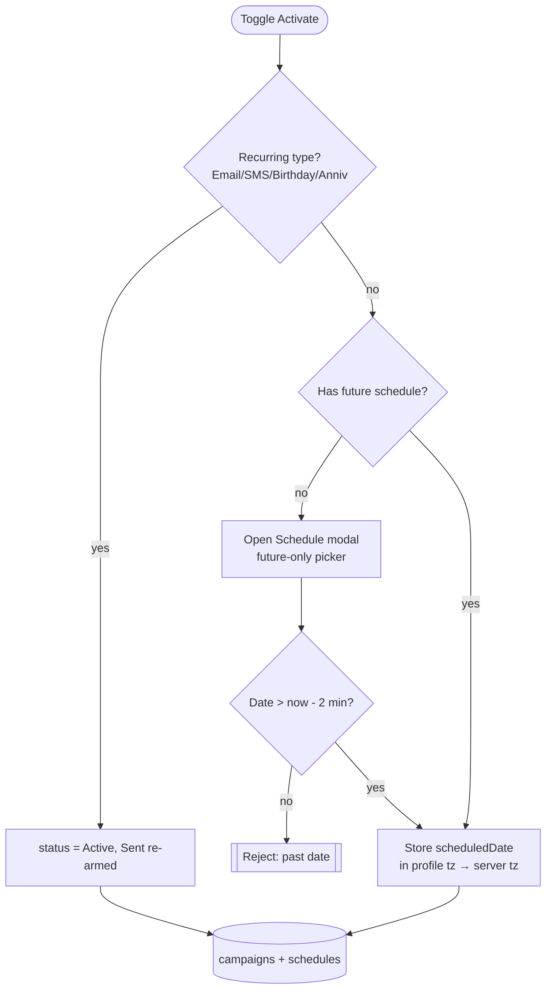
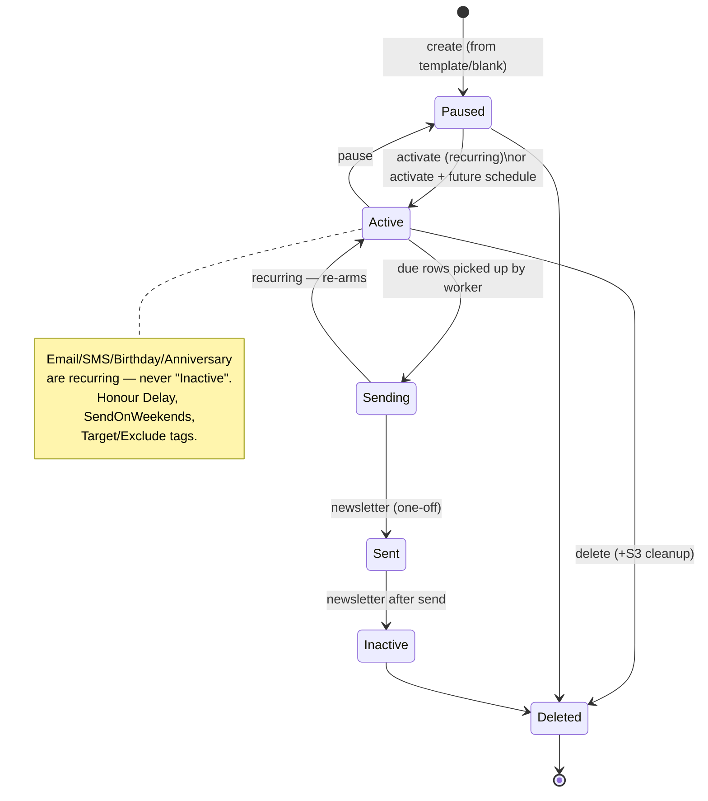

# Campaigns — Activity / Flow Diagrams

Mermaid flow diagrams for the campaigns domain. Render natively in GitHub/VSCode. Actor lanes are
subgraphs (Operator / Web / API / Worker / Provider).

Pairs with [user-stories.md](./user-stories.md) and [`../feature-spec/campaigns.md`](../feature-spec/campaigns.md).

Index:
1. [Create from template](#1-create-a-campaign-from-a-template)
2. [Async delivery (sender/newsletter)](#2-async-delivery-sendernewsletter)
3. [Activate / schedule](#3-activate--schedule)
4. [Send a test](#4-send-a-test)
5. [Stats roll-up](#5-stats-roll-up)
6. [Campaign lifecycle state machine](#6-campaign-lifecycle-state-machine)

---

## 1. Create a campaign from a template

```mermaid
flowchart TD
    subgraph Operator
        A([Open /campaigns/templates?type=]) --> B[Browse categories / search]
        B --> C[Click a template or Blank]
        C --> D[Create modal: Name + Subject]
        D --> E[Continue]
    end
    subgraph API
        E --> F{name + subject valid?\ntype in allowed set}
        F -- no --> G[[422 inline errors]]
        F -- yes --> H[Insert campaign row\nstatus = Paused]
        H --> I[Seed S3 design.json/email.html\nfrom template or blank]
        I --> J[[201 {id}]]
    end
    J --> K([Redirect /campaigns/editor/:id])
```

---

## 2. Async delivery (sender/newsletter)



> Fix-on-rebuild: due-time + weekend skip computed in the **profile timezone**, never hardcoded Pacific.

---

## 3. Activate / schedule



---

## 4. Send a test

```mermaid
flowchart TD
    subgraph Operator
        A([Send a test]) --> B[Enter name + email/phone]
        B --> C[Submit with reCAPTCHA token]
    end
    subgraph API
        C --> D{reCAPTCHA score >= 0.5?}
        D -- no --> E[[Reject]]
        D -- yes --> F[Upsert recipient Active\nSource = Self Test]
        F --> G[Create tracker IsTest=1]
        G --> H[Fetch HTML from S3\nrender placeholders]
        H --> I{Email or SMS?}
        I -- Email --> J[sendEmail Lambda → SendGrid]
        I -- SMS --> K[Twilio Messages API\n(maybe sandbox phone)]
        J --> L[Record schedule IsTest=1, Sent=1]
        K --> L
    end
```

---

## 5. Stats roll-up

```mermaid
flowchart LR
    subgraph Sources
        S1[(campaign_schedules)] --> M[subscribers = sent 0\nsent = sent 1 + date\n(IsTest = 0)]
        S2[(campaign_events)] --> N[opens / clicks\nby eventType]
    end
    M --> P[GET /campaigns/:id/stats\n{subscribers, sent, opens, clicks}]
    N --> P
    M --> Q[GET /campaigns/stats?range\nnewsletter + anniversary timelines]
    N --> Q
    Q --> R[1mo = daily buckets,\nelse monthly]
```

> Fix-on-rebuild: return list stats inline/batched instead of one request per row (N+1).

---

## 6. Campaign lifecycle state machine


</content>
