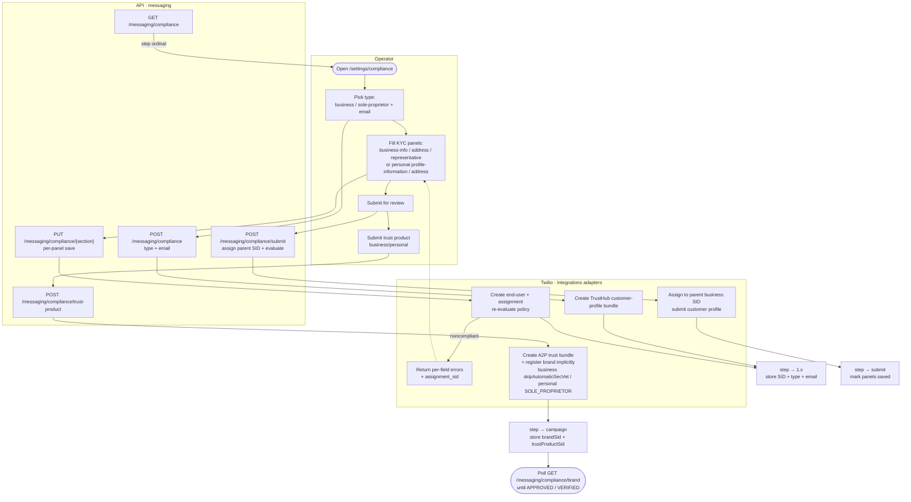
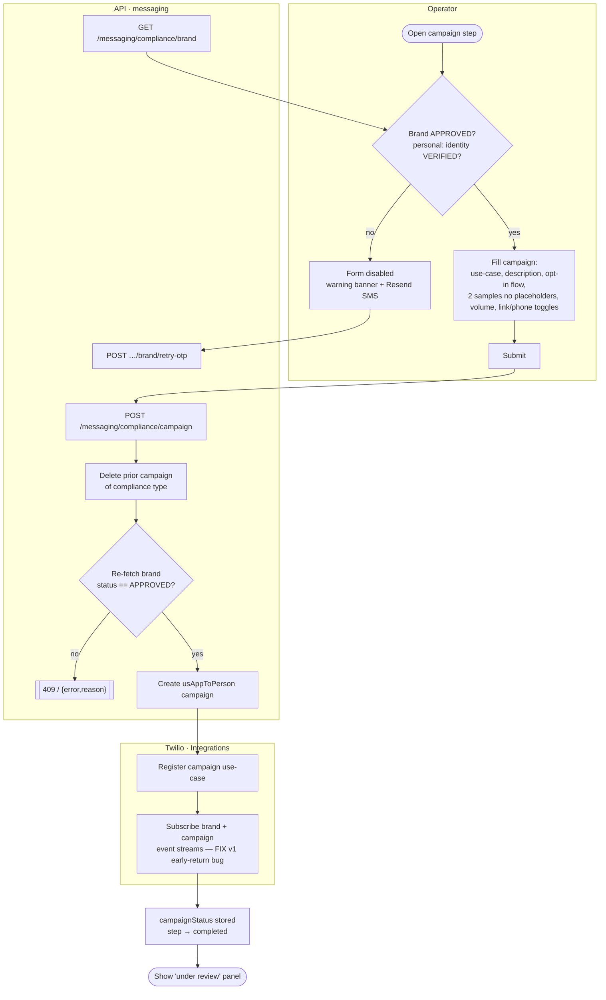
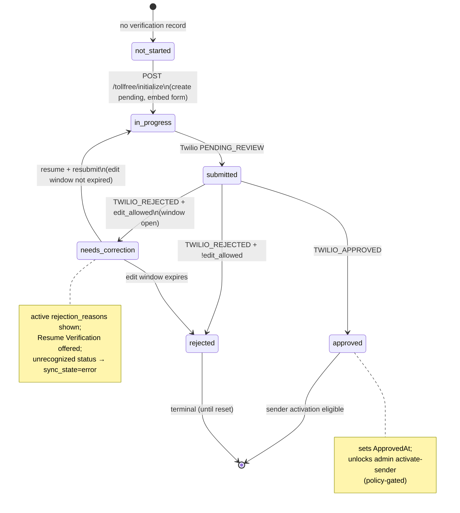
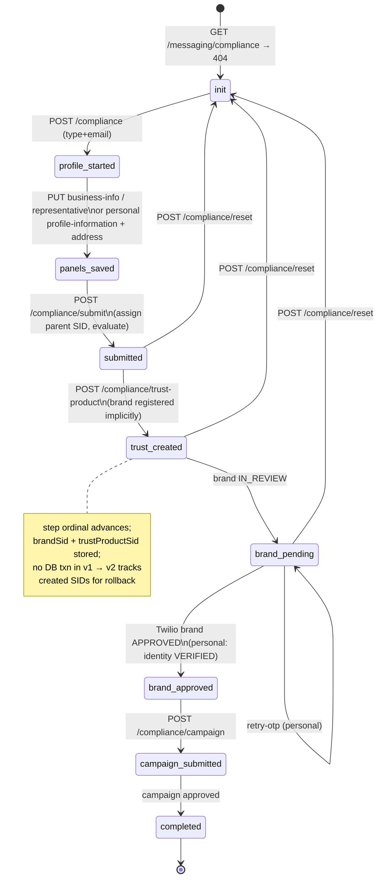

# Messaging Compliance — Activity / Flow Diagrams

Mermaid flow + state diagrams for the Twilio A2P 10DLC & toll-free compliance domain. They render
natively in GitHub and VSCode (Mermaid preview). Actor "lanes" are modelled with subgraphs
(Operator / Account Manager / Web / API · messaging / Integrations · Twilio adapters / Twilio /
Worker).

Pairs with [user-stories.md](./user-stories.md) and the spec at
[`../feature-spec/twilio-a2p-compliance.md`](../feature-spec/twilio-a2p-compliance.md).

Index:
1. [Brand / customer-profile registration (10DLC wizard)](#1-brand--customer-profile-registration-us-11-17)
2. [Campaign use-case submission](#2-campaign-use-case-submission-us-18)
3. [Toll-free verification status webhook updates](#3-toll-free-verification-status-webhook-updates-us-31)
4. [Toll-free number → messaging-service linkage (admin)](#4-toll-free-number--messaging-service-linkage-us-41-43)
5. [Toll-free verification status — state machine](#5-toll-free-verification-status--state-machine)
6. [10DLC step / brand / campaign — state machine](#6-10dlc-step--brand--campaign--state-machine)

---

## 1. Brand / customer-profile registration (US-1.1–1.7)



---

## 2. Campaign use-case submission (US-1.8)



---

## 3. Toll-free verification status webhook updates (US-3.1)

```mermaid
flowchart TD
    subgraph Twilio
        A([TFV decision:\nPENDING_REVIEW / TWILIO_APPROVED / TWILIO_REJECTED]) --> B[POST /integrations/twilio/tollfree/status\nsigned payload]
    end
    subgraph Integrations[API · integrations webhook]
        B --> C{Valid X-Twilio-Signature?\nper-subaccount auth token}
        C -- no --> D[[401 unauthorized]]
        C -- yes --> E[Idempotency key =\nevent_id or sha1(reg+status+occurred+sid)]
        E --> F{Key already seen?}
        F -- yes --> G[[200 &lbrace;status:'duplicate'&rbrace;]]
        F -- no --> H[Map Twilio status → portal status]
    end
    subgraph Mapper[Pure · TollfreeStatusMapper]
        H --> M1{status?}
        M1 -- PENDING_REVIEW --> N1[portal = submitted]
        M1 -- TWILIO_APPROVED --> N2[portal = approved\nset approvedAt]
        M1 -- TWILIO_REJECTED --> N3{edit_allowed &&\nwindow open?}
        N3 -- yes --> N4[portal = needs_correction]
        N3 -- no --> N5[portal = rejected\nset rejectedAt]
        M1 -- other --> N6[sync_state = error\nlog status_unrecognized]
    end
    subgraph Persist[API · messaging repository]
        N1 --> W[Write verification_events row]
        N2 --> W
        N4 --> W
        N5 --> W
        N6 --> W
        W --> X[Update verification\ndeactivate prior rejections\ninsert active rejection if present]
        X --> Y[[200 snapshot]]
    end
    Y -.->|next Operator load /\ndebounced post-submit sync| Z([Status card + history reflect change])
```

---

## 4. Toll-free number → messaging-service linkage (US-4.1–4.3)

```mermaid
flowchart TD
    subgraph Manager[Account Manager · account_type >= 2]
        A([Open admin toll-free panel]) --> B[Enable eligibility]
        B --> C[Assign available number]
        C --> D[Activate sender]
    end
    subgraph API[API · admin profiles/tollfree]
        B --> E[POST …/tollfree/eligibility\nenabled=true → set EligibleAt + ByUserID]
        GN[GET …/tollfree/numbers\nreserved/released, unassigned] --> C
        C --> F{number reserved|released?\nprofile eligible?\nno active number?}
        F -- no --> FE[[409 blocked reason]]
        F -- yes --> G[ownership_state = assigned\nlink PhoneNumberSid + MessagingServiceSid]
        D --> H[POST …/tollfree/activate-sender]
    end
    subgraph Policy[Pure · TollfreeSenderActivationPolicy]
        H --> P{can_activate? ALL of:\nassigned number ∧ latest portal=approved\n∧ INBOUND_ROUTING_ENABLED\n∧ PILOT_SCOPE=web_connect_only}
        P -- no --> PE[[Surface blocking reasons]]
        P -- yes --> Q[TollfreeSendMode = active\nset ActivatedAt + ByUserID]
    end
    Q --> R[Log admin-source event\nidempotency key admin-activate-…]
    R --> S([Inbound To → number resolves\nvia TollfreeInboundResolver\nelse profiles.SMSNumber])
```

---

## 5. Toll-free verification status — state machine



---

## 6. 10DLC step / brand / campaign — state machine


