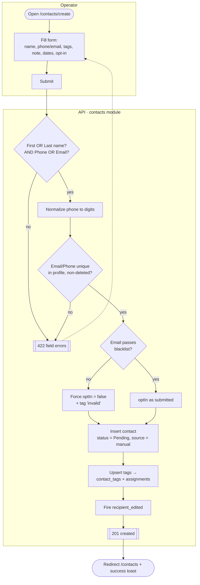
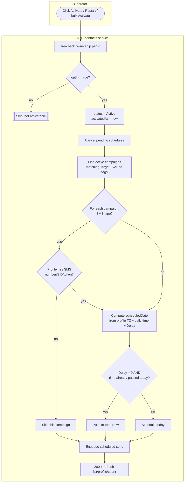
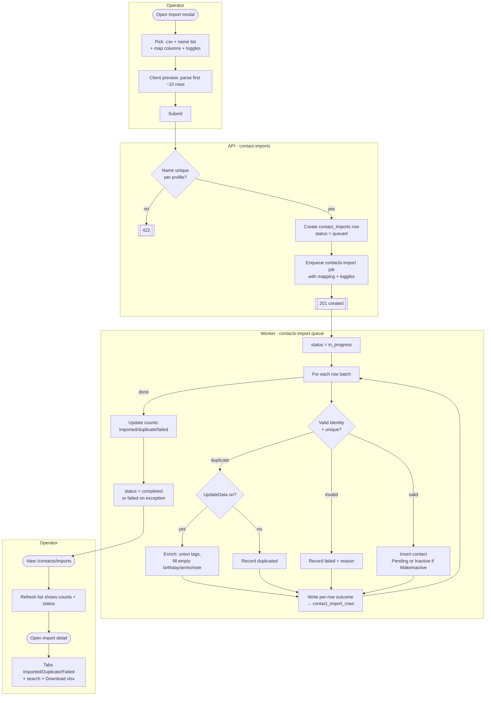
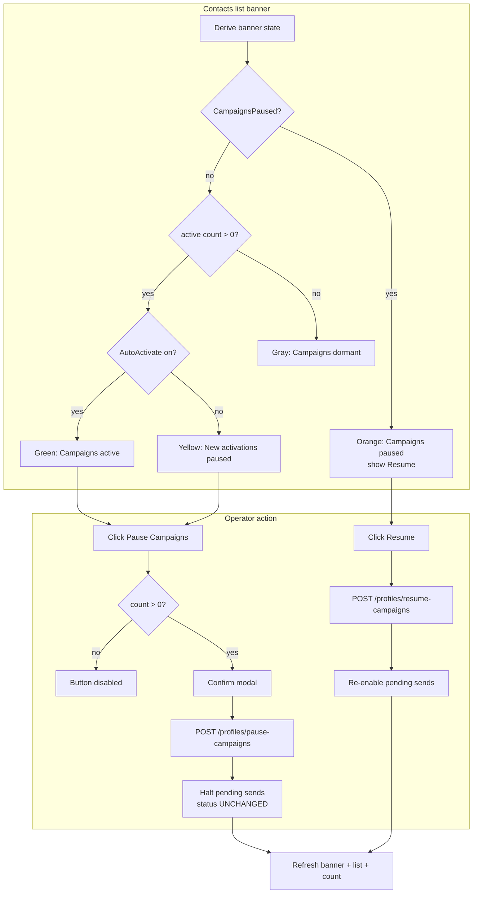
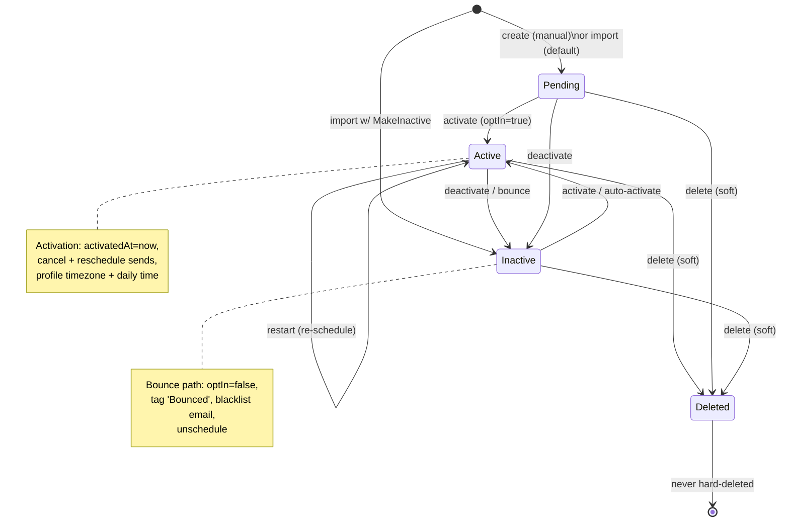

# Contacts — Activity / Flow Diagrams

Mermaid flow diagrams for the contacts domain. They render natively in GitHub and VSCode
(Mermaid preview). Actor "lanes" are modelled with subgraphs (Operator / Web / API / Worker / Scheduler).

Pairs with [user-stories.md](./user-stories.md) and the spec at
[`../feature-spec/contacts.md`](../feature-spec/contacts.md).

Index:
1. [Create a contact](#1-create-a-contact-us-21)
2. [Activate a contact (scheduling side-effects)](#2-activate-a-contact-us-31)
3. [Browse / search / filter the list](#3-browse--search--filter-us-11-15)
4. [Async CSV import](#4-async-csv-import-us-51-53)
5. [Daily auto-activation job](#5-daily-auto-activation-job-us-71)
6. [Pause / resume campaigns](#6-pause--resume-campaigns-us-72)
7. [Contact lifecycle state machine](#7-contact-lifecycle-state-machine)

---

## 1. Create a contact (US-2.1)



---

## 2. Activate a contact (US-3.1)



> Fix-on-rebuild: timezone comes from the **profile**, never a hardcoded `America/Los_Angeles`.

---

## 3. Browse / search / filter (US-1.1–1.5)

```mermaid
flowchart LR
    subgraph Web
        A([Load /contacts]) --> B[Read params from URL\n+ sessionStorage]
        B --> C[GET /contacts?sort,dir,page,perpage,\nquery,status,date_added_range]
        I[User types in search] -->|debounced, page→1| C
        J[User clicks status tab] -->|page→1| C
        K[User changes date range] --> C
        L[User clicks sortable header] --> C
    end
    subgraph API
        C --> D[Scope to profileId\nStatus != Deleted]
        D --> E{query present?}
        E -- yes --> F[Match name/phone/email/tags]
        E -- no --> G[All in scope]
        F --> H
        G --> H[Apply status + date cutoff]
        H --> M[Join last-activity read model\nNOT a per-row subquery]
        M --> N[Offset paginate]
        N --> O[[data[], page, total, pages]]
    end
    O --> P[Render table / skeleton / empty state]
    P --> Q[Persist params + scroll to sessionStorage]
```

---

## 4. Async CSV import (US-5.1–5.3)



> Schema gap: `contact_import_rows` (per-row outcomes) is not in the v2 schema yet.

---

## 5. Daily auto-activation job (US-7.1)

```mermaid
flowchart TD
    subgraph Scheduler
        A([Daily tick]) --> B[For each profile where\nAutoActivateRecipients = on]
        B --> C{Now == TimeActivateRecipients\nin profile timezone?}
        C -- no --> Z[Wait]
        C -- yes --> D[Select up to AutoActivateLimit\n(max 500) Pending/Inactive contacts]
    end
    subgraph Worker
        D --> E[For each selected contact]
        E --> F[Run activation flow\n→ diagram #2]
        F --> E
        E -->|done| G[[Contacts enrolled + scheduled]]
    end
```

---

## 6. Pause / resume campaigns (US-7.2)



---

## 7. Contact lifecycle state machine



> Open question: v2 `contact_status` enum (`pending/activated/bounced/unsubscribed/suppressed`) has no
> direct `inactive`/`deleted` value — map `Active→activated`, `Deleted→deletedAt`, and resolve
> `Inactive` before the Inactive tab + Restart ship.
</content>
