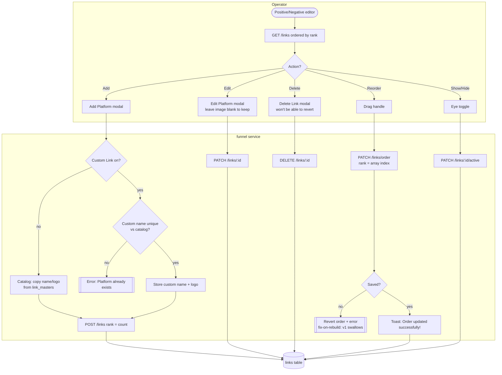
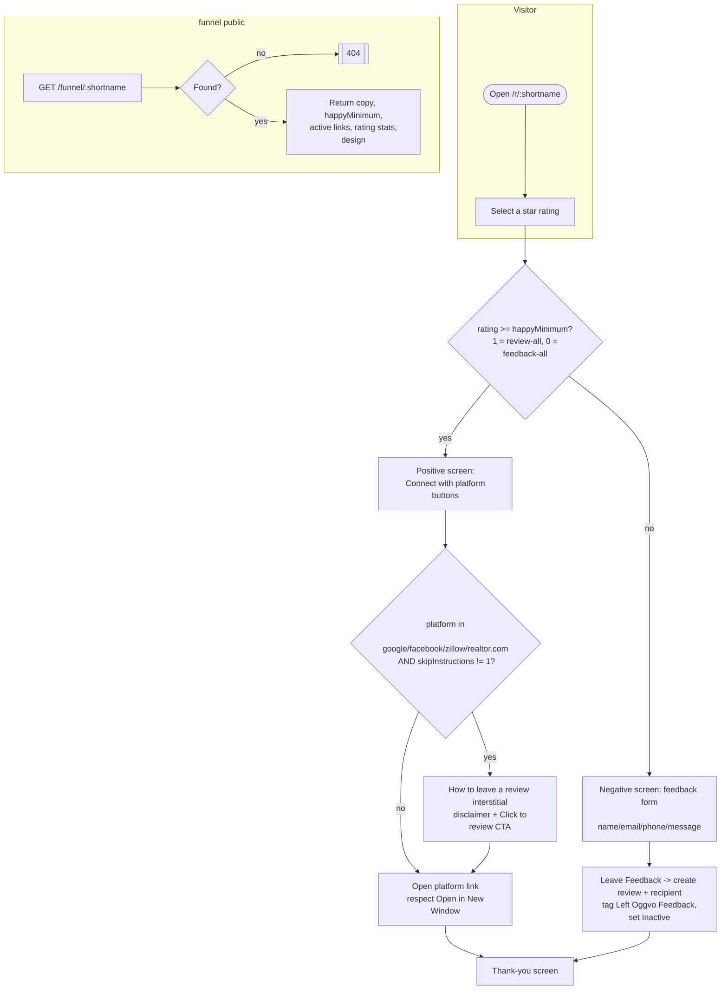
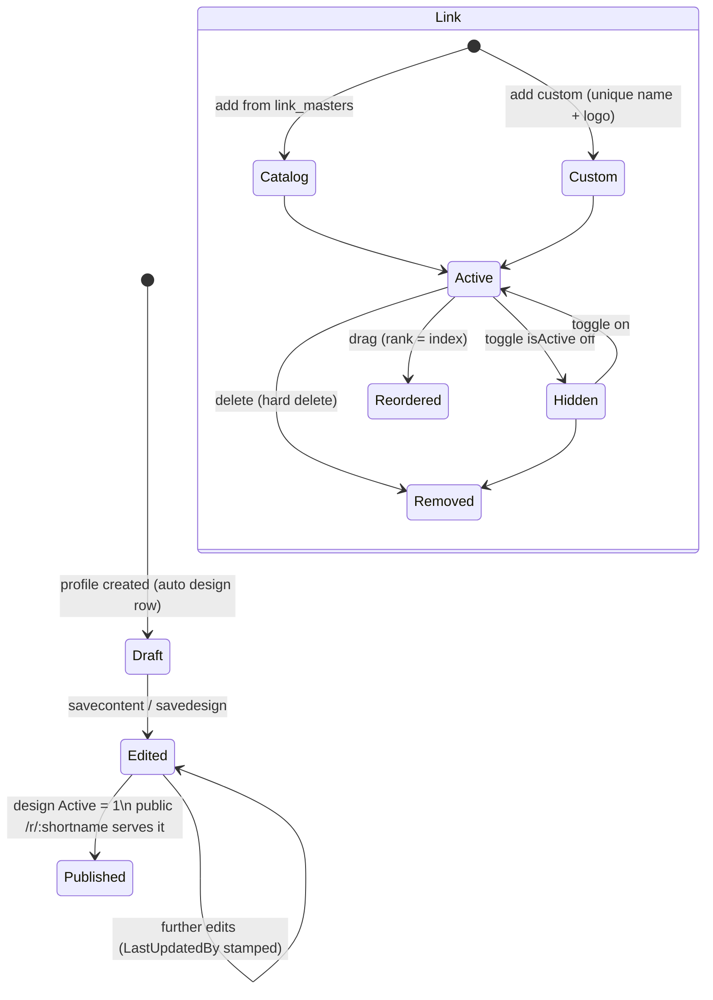

# Design & Funnel — Activity / Flow Diagrams

Mermaid flow diagrams for the design/funnel domain. They render natively in GitHub and VSCode.
Actor "lanes" are modelled with subgraphs (Operator / Web / API / Store / Visitor).

Pairs with [user-stories.md](./user-stories.md), [`../feature-spec/design-funnel.md`](../feature-spec/design-funnel.md),
and the reviews companion ([reviews activity-diagrams](../reviews/activity-diagrams.md) covers ingestion / share /
auto-share / the public-funnel review side).

Index:
1. [Content editor save (Positive / Negative / Thank You)](#1-content-editor-save)
2. [Visual designer load & save (S3 → DB)](#2-visual-designer-load--save-s3--db)
3. [Platform-link manager (add / edit / delete / reorder / toggle)](#3-platform-link-manager)
4. [Public funnel routing + instructions interstitial](#4-public-funnel-routing--instructions-interstitial)
5. [Link & funnel-design lifecycle](#5-link--funnel-design-lifecycle)

---

## 1. Content editor save

```mermaid
flowchart TD
    subgraph Operator
        A([Open /design/positive | negative | thanks]) --> B[GET /design\n profile copy + rating stats]
        B --> C[Edit Header / Body / HappyMinimum\n live preview updates]
        C --> D[Click Apply]
    end
    subgraph API[funnel service]
        D --> E[POST /design/savecontent\n only this tab's field set]
        E --> F{Field in allowlist?\n header->MessageHeader,\n body->MessageText,\n footer->CustomPoweredBy}
        F -- no --> G[[Reject unknown key\n fix-on-rebuild: v1 mass-assigns]]
        F -- yes --> H[Write fields + stamp LastUpdatedBy]
        H --> I{All saved?}
        I -- no --> J[[errors: Could not save field!]]
        I -- yes --> K[[message: Data Saved Successfully!]]
    end
    K --> L[Toast: Data updated successfully!]
    L --> M[(profile / funnel_content)]
```

---

## 2. Visual designer load & save (S3 → DB)

```mermaid
flowchart TD
    subgraph Operator
        A([Open /design Main tab]) --> B[Unlayer editor loads]
        B --> C[GET /design/getdesign]
        E[Drag/drop blocks, insert image] --> F[Click Save]
        K[Delete an uploaded image] --> K1{Confirm\n Are you sure you want\n to delete this file?}
        K1 -- yes --> K2[DELETE media/:id/image]
    end
    subgraph API[funnel service]
        C --> C1{Design exists?}
        C1 -- no --> C2[[design: null - blank canvas]]
        C1 -- yes --> C3[Load editor design]
        C3 -. load fails .-> C4[[Toast: We could not load\n your existing design!]]
        F --> G[exportHtml -> json + html{fonts,css,body}]
        G --> H[POST /design/savedesign]
        H --> I{Saved?}
        I -- yes --> J[[Store inline:\n funnel_designs.exported_json/html]]
        I -- no --> J2[[Toast: We could not save your design!]]
    end
    J --> Z[Toast: Data Saved Successfully!]
```

> v1 wrote `funnel.json` + `html.json` to S3 (CSS minified, body `utf8_encode`d). v2 stores inline in the DB and
> the public page injects sanitized HTML — no runtime Vue template compile.

---

## 3. Platform-link manager



---

## 4. Public funnel routing + instructions interstitial



> Parity gap: Yelp has a server-side instruction view but no Vue modal branch — add it in v2.

---

## 5. Link & funnel-design lifecycle


