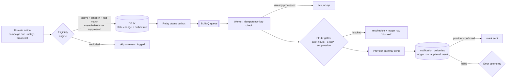
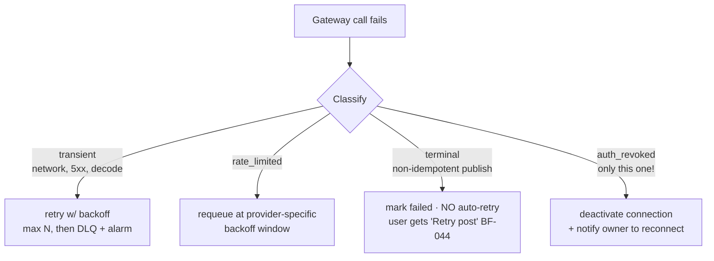
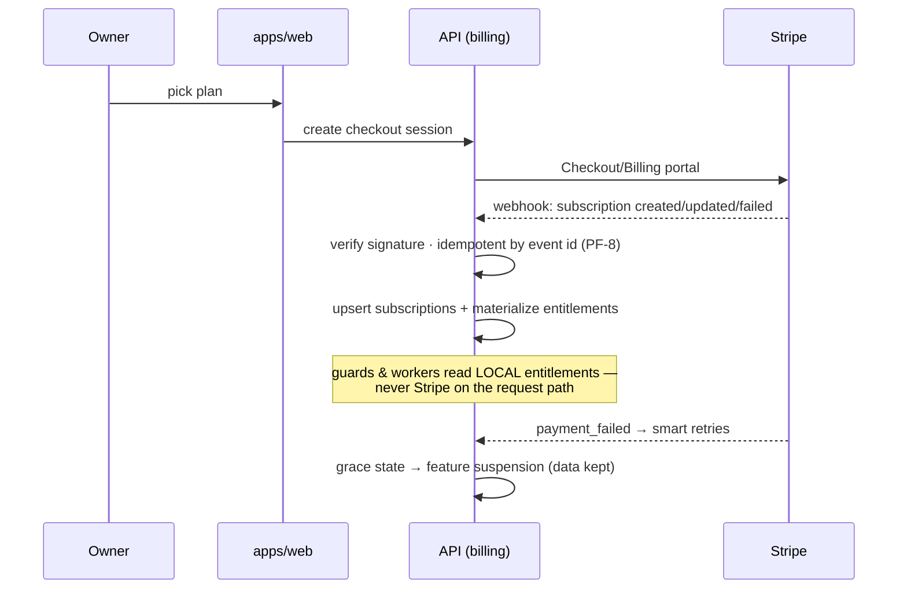
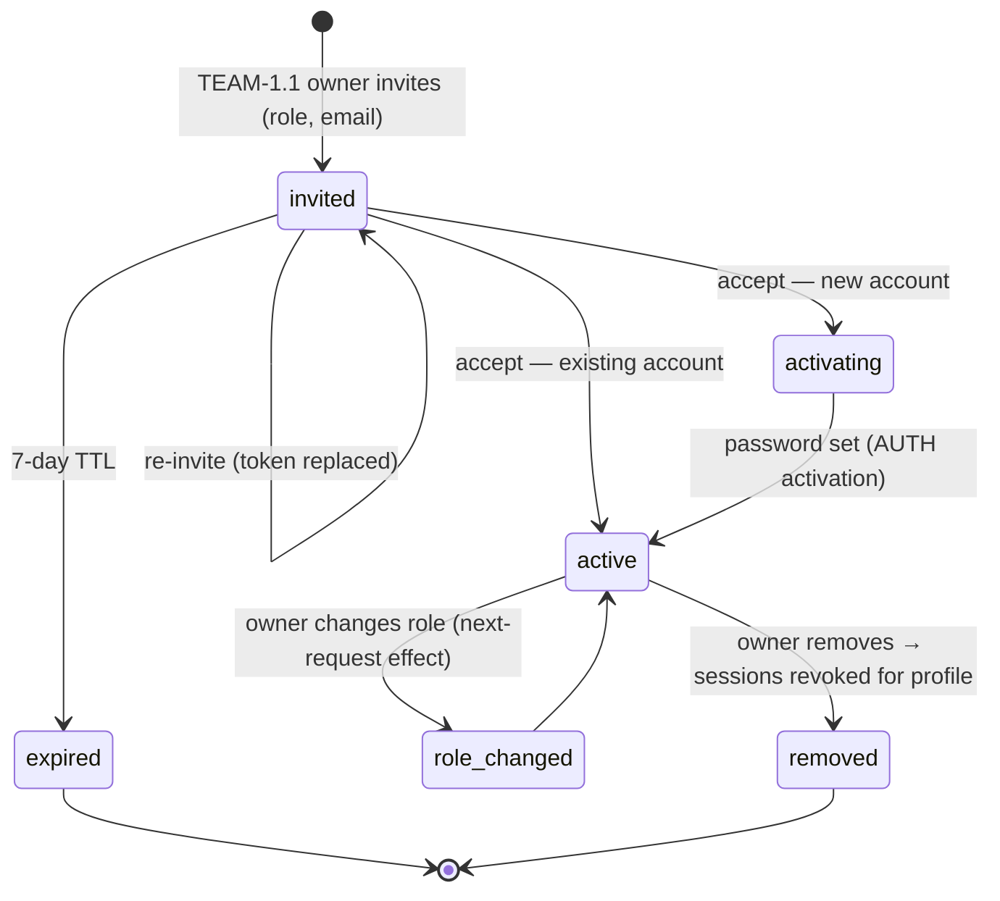
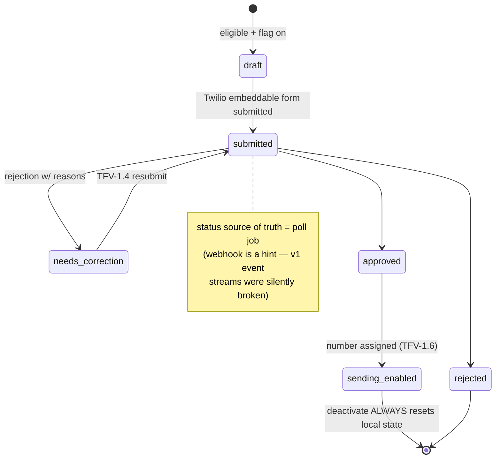
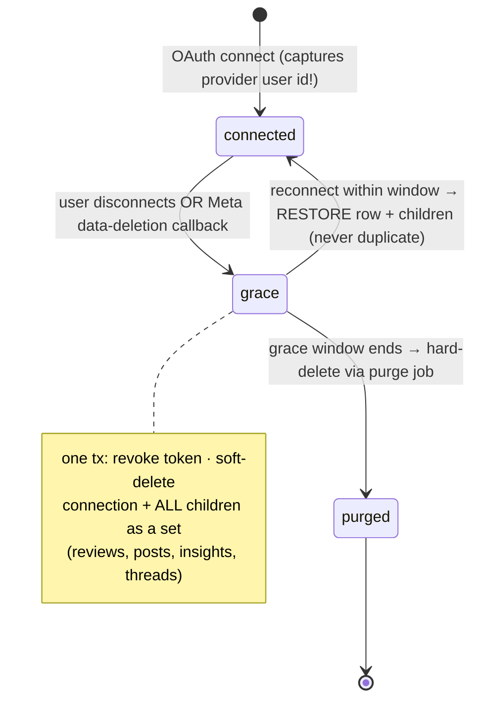
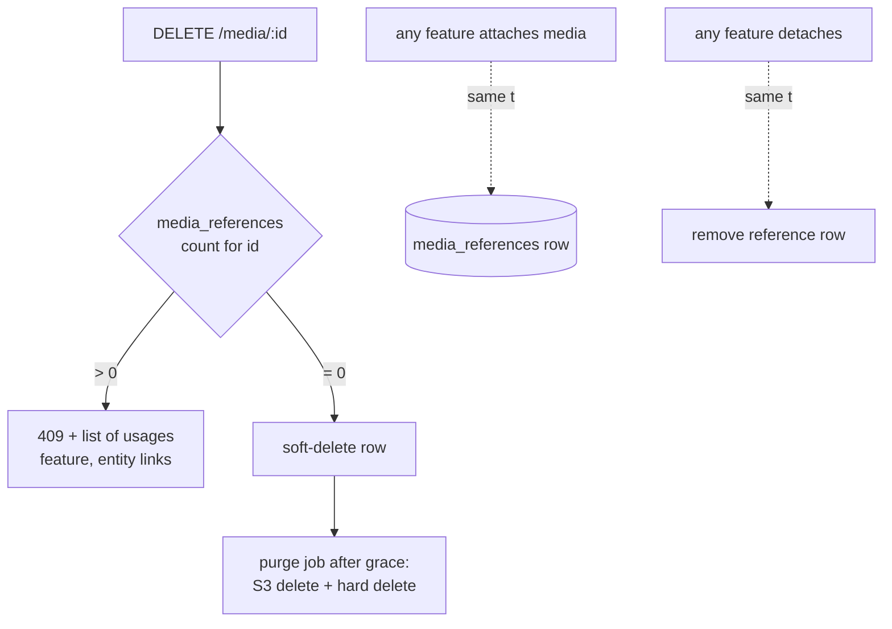
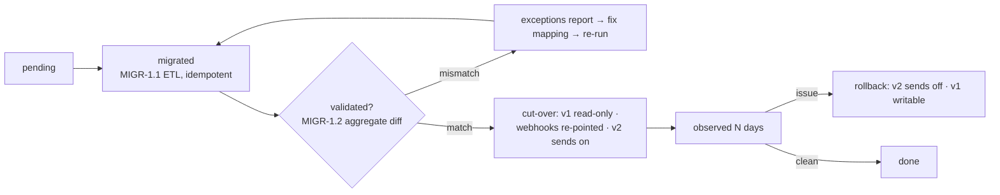

# Flow diagrams — cross-cutting & new-epic flows

Mermaid diagrams (render on GitHub/VS Code) for the flows introduced by the foundation that no
per-domain `activity-diagrams.md` covers. Per-domain flows stay in `docs/<domain>/activity-diagrams.md`;
known thin spots there: **media, referrals, support, tutorials** have no diagram file (small,
mostly-CRUD domains — add when their epics start, using the format of the other 13).

## 1. The send pipeline (every outbound message — PF-4/5/6/17)

## 2. Provider error taxonomy (AD-13 — the Zillow-incident fix)

## 3. Billing & entitlements (AD-14)

## 4. Team invite lifecycle (TEAM epic)

## 5. Toll-free verification state machine (TFV / AD-15)

## 6. Provider disconnect / reconnect lifecycle (INT — PF-2/PF-5)

## 7. Media reference-counted delete (MEDIA — PF-10)

## 8. v1 profile migration & cutover (MIGR — unscheduled)

