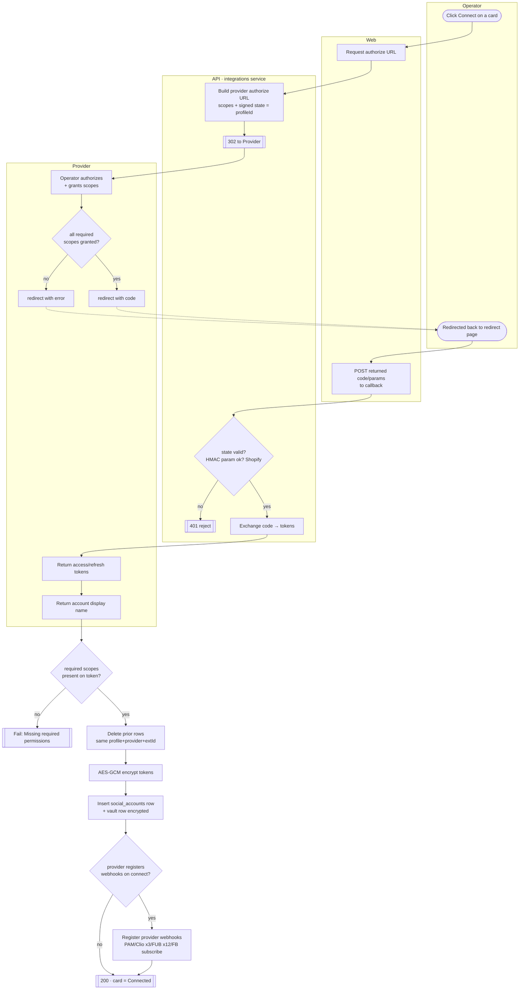
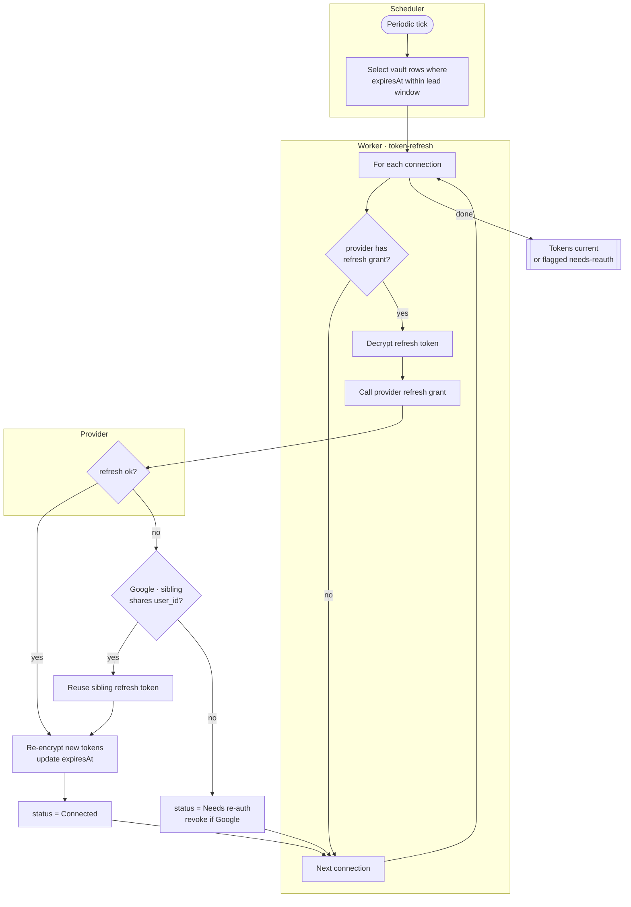
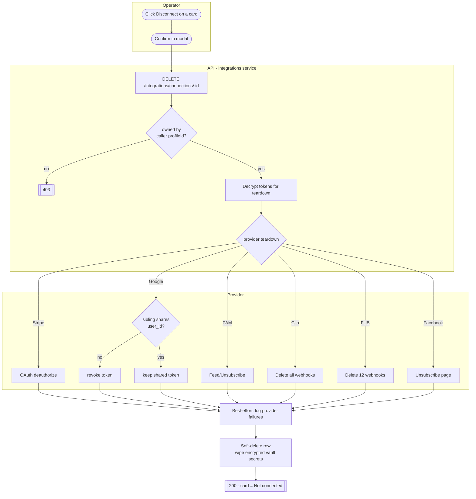
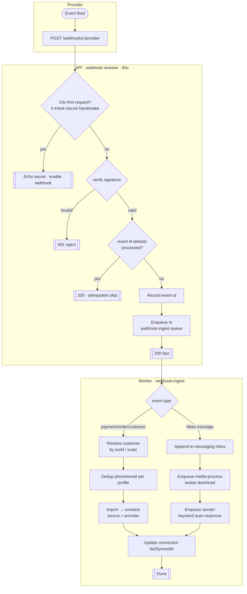
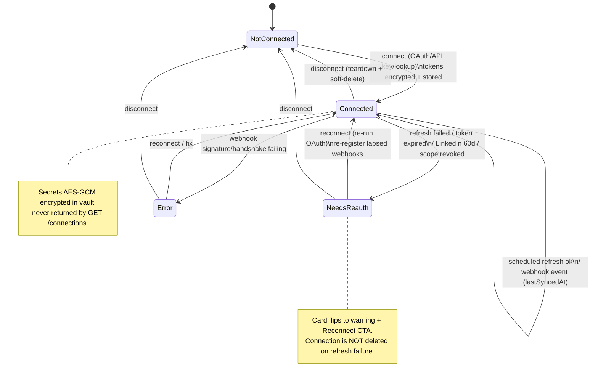

# Integrations & OAuth Vault — Activity / Flow Diagrams

Mermaid flow diagrams for the integrations domain. They render natively in GitHub and VSCode
(Mermaid preview). Actor "lanes" are modelled with subgraphs
(Operator / Web / API / Worker / Scheduler / **Provider**).

Pairs with [user-stories.md](./user-stories.md) and the spec at
[`../feature-spec/integrations-oauth.md`](../feature-spec/integrations-oauth.md).

Index:
1. [OAuth connect (authorize → callback → encrypted token store)](#1-oauth-connect-us-21-22)
2. [Provider sub-selection (pages / locations / orgs)](#2-provider-sub-selection-us-23)
3. [Scheduled token refresh](#3-scheduled-token-refresh-us-31)
4. [Disconnect & revoke (provider teardown)](#4-disconnect--revoke-us-41)
5. [Inbound webhook ingest (signature → enqueue → import)](#5-inbound-webhook-ingest-us-51-52)
6. [Connection status state machine](#6-connection-status-state-machine)

---

## 1. OAuth connect (US-2.1, US-2.2)



> Fix-on-rebuild: tokens are AES-GCM encrypted, never plaintext; `state` is verified (CSRF);
> Shopify HMAC is enforced and the shop stored per-connection.

---

## 2. Provider sub-selection (US-2.3)

```mermaid
flowchart TD
    subgraph API[API · after token exchange]
        A[Temp token row stored] --> B{provider}
    end
    subgraph Provider
        B -- Meta --> C[List managed pages /me/accounts]
        C --> D[Per page: discover\ninstagram_business_account]
        B -- LinkedIn --> E[List member + admin'd orgs]
        B -- Google --> F[List accounts + locations]
    end
    subgraph Operator
        D --> G([Pick page(s)])
        E --> H([Pick org(s)])
        F --> I([Pick location])
    end
    subgraph Persist[API · integrations]
        G --> J[Insert social_accounts per page\n+ separate instagram row if IG-scoped]
        H --> K[Insert row per chosen org URN\ndelete temp token row]
        I --> L[Write location pageID + review URI\n+ place_id onto profile]
        J --> M[[Connections saved]]
        K --> M
        L --> M
    end
```

---

## 3. Scheduled token refresh (US-3.1)



> Replaces v1's opportunistic inline refresh. Clio's 30-day webhook expiry is renewed on the same cadence.

---

## 4. Disconnect & revoke (US-4.1)



> Teardown is best-effort: a provider-side failure is logged but the local disconnect still completes.

---

## 5. Inbound webhook ingest (US-5.1, US-5.2)



> Fix-on-rebuild: signature verification enforced for **all** providers (incl. Square / Twilio SMS /
> Shopify); event-id idempotency rejects replays; processing is async so the 200 returns fast.

---

## 6. Connection status state machine


