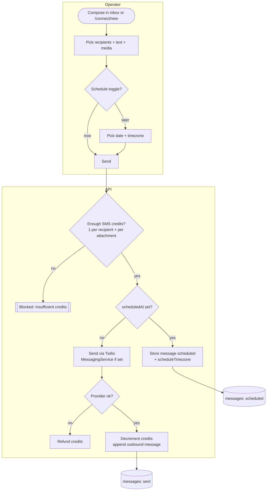
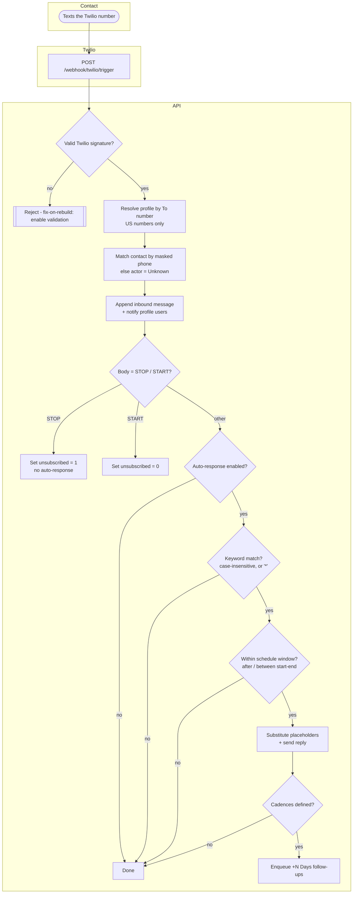
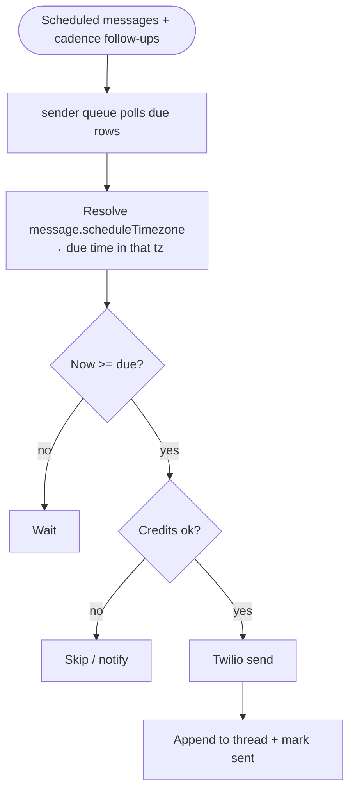
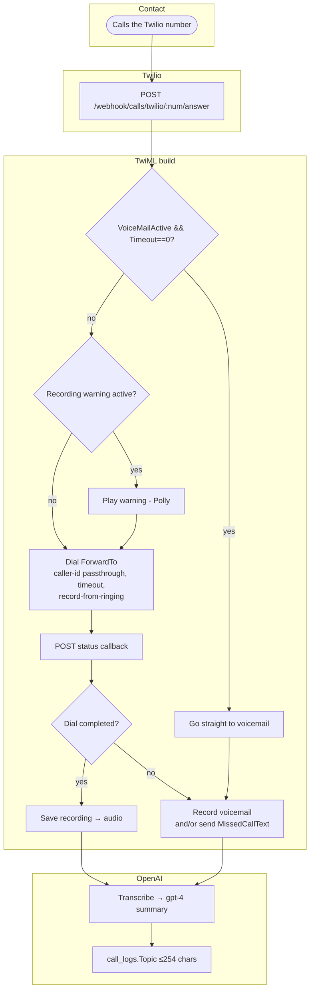
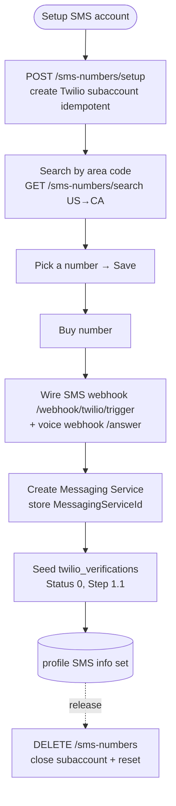
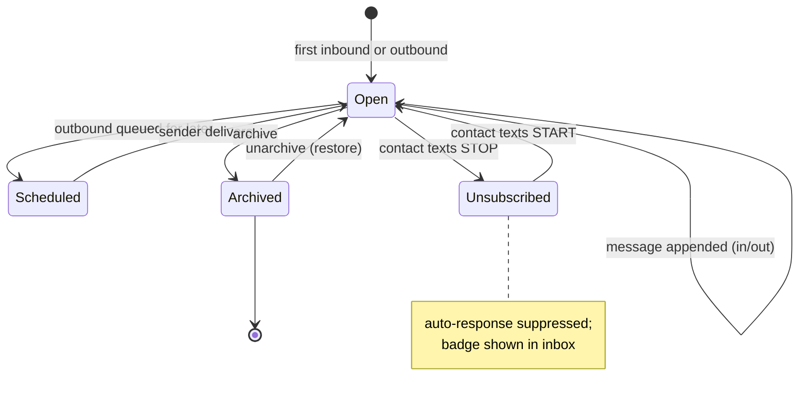

# Connect (Messaging & Calls) — Activity / Flow Diagrams

Mermaid flow diagrams for the messaging domain. Render natively in GitHub/VSCode. Actor lanes are
subgraphs (Contact / Web / API / Worker / Twilio / OpenAI).

Pairs with [user-stories.md](./user-stories.md) and [`../feature-spec/connect-messaging.md`](../feature-spec/connect-messaging.md).

Index:
1. [Send / schedule a message](#1-send--schedule-a-message)
2. [Inbound SMS + auto-responder](#2-inbound-sms--auto-responder)
3. [Scheduled delivery (sender)](#3-scheduled-delivery-sender-queue)
4. [Inbound call → forward / voicemail](#4-inbound-call--forward--voicemail)
5. [Number provisioning](#5-number-provisioning)
6. [Conversation state machine](#6-conversation-state-machine)

---

## 1. Send / schedule a message

---

## 2. Inbound SMS + auto-responder

---

## 3. Scheduled delivery (sender queue)

> Fix-on-rebuild: resolve the message's actual timezone, not the v1 hardcoded 5-zone Pacific map.

---

## 4. Inbound call → forward / voicemail

---

## 5. Number provisioning

---

## 6. Conversation state machine

</content>
