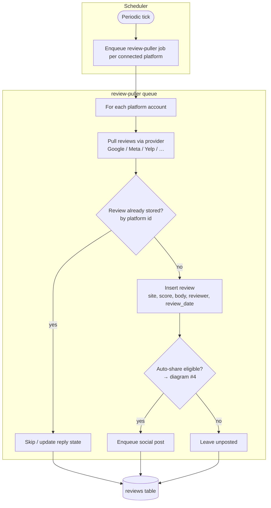
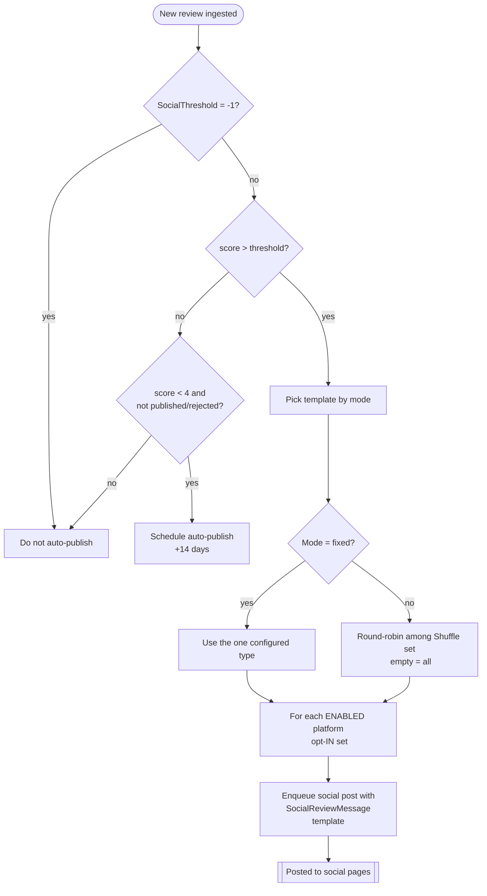
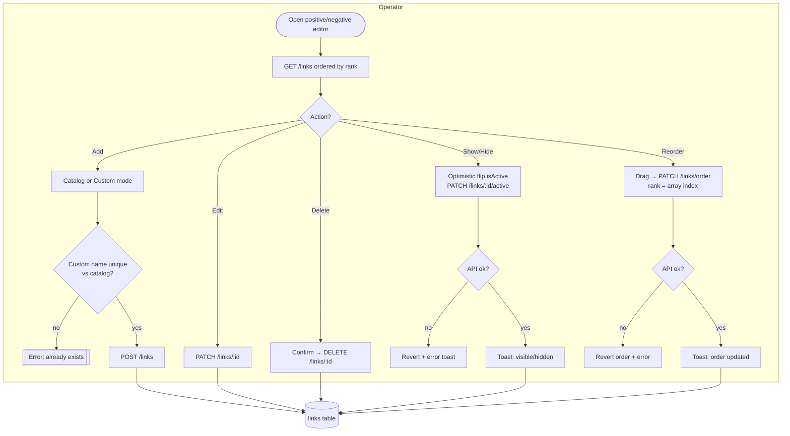
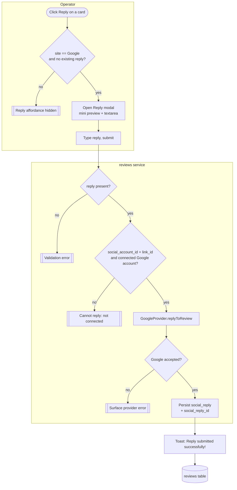

# Reviews & Funnel — Activity / Flow Diagrams

Mermaid flow diagrams for the reviews + funnel domains. They render natively in GitHub and VSCode.
Actor "lanes" are modelled with subgraphs (Visitor / Web / API / Worker / Platform).

Pairs with [user-stories.md](./user-stories.md), [`../feature-spec/reviews.md`](../feature-spec/reviews.md)
and [`../feature-spec/design-funnel.md`](../feature-spec/design-funnel.md).

Index:
1. [Review ingestion (review-puller)](#1-review-ingestion-review-puller)
2. [Browse / filter the feed](#2-browse--filter-the-feed)
3. [Share a review to social](#3-share-a-review-to-social)
4. [Auto-share decision](#4-auto-share-decision-incoming-review)
5. [Public funnel routing](#5-public-funnel-routing-visitor)
6. [Platform-link manager](#6-platform-link-manager)
7. [Review lifecycle state machine](#7-review-lifecycle-state-machine)
8. [Reply to a review (Google)](#8-reply-to-a-review-google)
9. [Review-image render & cache (BF-004)](#9-review-image-render--cache-bf-004)

---

## 1. Review ingestion (review-puller)



> Replaces v1 `review-puller-bot`. Pull-based — no inbound webhooks in this domain.

---

## 2. Browse / filter the feed

```mermaid
flowchart LR
    subgraph Web
        A([Load /reviews]) --> B[GET /reviews?page,limit,query,\nplatforms[],ratings[],dates[]]
        F[Change any filter] -->|throttled ~1s, page→1| B
        S[Scroll to bottom] -->|page < pages| B
        V[Toggle List/Grid] -->|cookie| R
    end
    subgraph API
        B --> C[Scope to profileId\nexclude permanent_delete]
        C --> D{HideOggvoReviews?}
        D -- yes --> E[Exclude site = Oggvo]
        D -- no --> G
        E --> G[Apply query / platforms / ratings / date range]
        G --> H[Order review_date DESC, paginate]
        H --> I[Attach socials posted-state per review]
        I --> J[[data[], total, page, pages]]
    end
    J --> R[Render cards / skeleton / empty state]
    R --> T[Append on scroll]
```

---

## 3. Share a review to social

```mermaid
flowchart TD
    subgraph Operator
        A([Click Share on a review]) --> B[Pick socials, message, style;\noptional schedule]
        B --> C[Submit]
    end
    subgraph API[reviews service]
        C --> D[Generate/lookup branded image\nnormalize style → one cache hash]
        D --> E{ScheduledDate present?}
        E -- yes --> F{Date >= now - 2 min?}
        F -- no --> G[[Reject: past date]]
        F -- yes --> H[Save social_post unpublished\nstore UTC + profile tz]
        E -- no --> I[For each selected platform]
        I --> J[Template message\n replace placeholders]
        J --> K[Publish via provider\nusing pre-generated image]
        K --> L{Success?}
        L -- no --> M[Collect in failed{} - no rollback]
        L -- yes --> N[Record social_post]
        H --> O[[Posting bot will publish later]]
        M --> P[[published[], failed{}]]
        N --> P
    end
```

> Fix-on-rebuild (BF-004): the style hash must match across `/image`, `/single`, `/share`.

---

## 4. Auto-share decision (incoming review)



> v2 inverts v1's opt-OUT `platform_whitelist` to an explicit opt-IN enabled set.

---

## 5. Public funnel routing (Visitor)

```mermaid
flowchart TD
    subgraph Visitor
        A([Open /r/:shortname]) --> B[Select a star rating]
    end
    subgraph API[funnel public]
        A0[GET /funnel/:shortname] --> A1{Found?}
        A1 -- no --> A2[[404]]
        A1 -- yes --> A3[Return copy, happyMinimum,\nactive links, rating stats, design]
    end
    B --> C{rating >= happyMinimum?\n(1 = review-all, 0 = feedback-all)}
    C -- yes --> D[Positive screen]
    D --> E[Click Connect with platform]
    E --> F{google/facebook/zillow/realtor\n& SkipInstructions != 1?}
    F -- yes --> G[Show how-to-review interstitial]
    F -- no --> H[Open platform link]
    G --> H
    H --> T[Thank-you screen]
    C -- no --> I[Negative screen:\nprivate feedback form]
    I --> J[Submit name/email/phone/message]
    J --> K[Create review + recipient\n tag 'Left Oggvo Feedback',\n set recipient Inactive,\n delete prior reviews]
    K --> T
```

---

## 6. Platform-link manager



---

## 7. Review lifecycle state machine

```mermaid
stateDiagram-v2
    [*] --> Ingested: review-puller pull
    [*] --> Manual: Operator adds manually
    [*] --> Feedback: public funnel (negative path)
    Ingested --> Posted: auto-share / manual share
    Manual --> Posted: manual share
    Ingested --> Scheduled: share with future date
    Scheduled --> Posted: posting bot publishes
    Scheduled --> Posted: +14d auto-publish (score < 4 rule)
    Ingested --> Replied: Google reply
    Posted --> Replied: Google reply
    Ingested --> Deleted: soft delete (permanent_delete=1)
    Manual --> Deleted
    Posted --> Deleted
    Deleted --> [*]: never hard-deleted; excluded from reads

    note right of Posted
        social_post recorded;
        per-platform failures
        collected, no rollback
    end note
```



---

## 8. Reply to a review (Google)



> Fix-on-rebuild: v1 only implements Google (other platforms silently return 201). v2 gates the UI to
> Google or extends providers — never show Reply where it would no-op.

---

## 9. Review-image render & cache (BF-004)

```mermaid
flowchart TD
    subgraph Web[share composer]
        A([Adjust ReviewStyleParams]) --> B[GET /reviews/:id/image\n type, version|custom_color, person,\n brand_logo/source_logo/reviewer_name/\n reviewer_image/action_button]
    end
    subgraph API[reviews service]
        B --> C[Normalize style ONCE\n compute cache key\n {reviewId}{profileId}{site}_{hash}]
        C --> D{Cached image exists\n and height == 1080\n and not force_generate?}
        D -- yes --> E[Return existing S3 / CDN url]
        D -- no --> F[Enqueue render job]
    end
    subgraph Worker[image render]
        F --> G[Headless render 1080x1080\n Playwright -> /review/single\n truncate name/body per type]
        G --> H[(Upload jpg to S3,\n store key in DB)]
        H --> E
    end
    E --> I([Preview shows image])
    I --> J[POST /reviews/:id/share]
    J --> K{Same normalized hash?}
    K -- yes --> L[[Share reuses the cached image]]
    K -- no --> M[[BF-004: lookup misses — regenerate]]
```

> BF-004: in v1 `custom_color` was hashed differently across `/image`, `/single` and `/share`, so the
> share lookup missed the generated image. v2 normalizes the style params once server-side so all three
> share one identical cache key. Replaces v1's `wkhtmltoimage`-over-NFS with a headless worker + S3.
