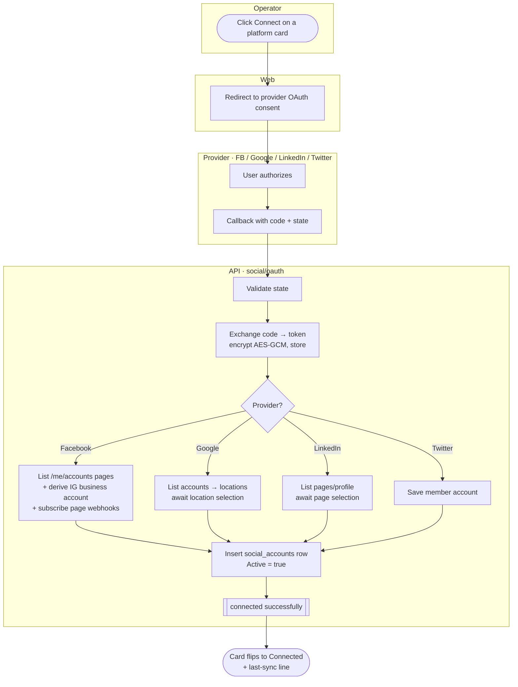
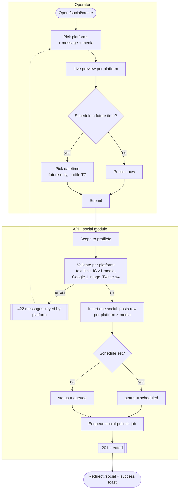
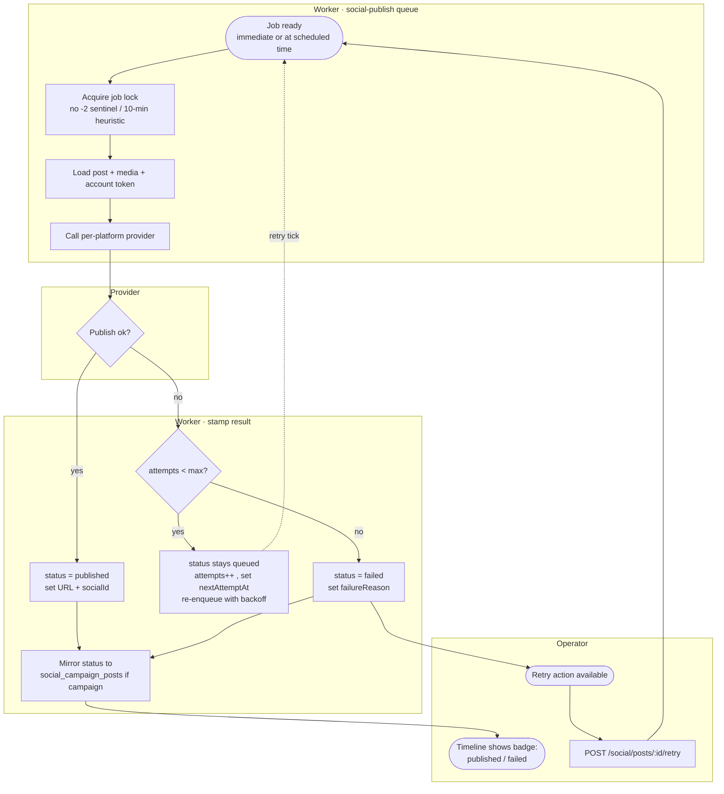
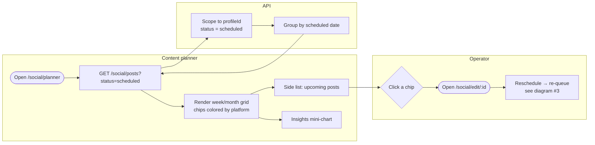
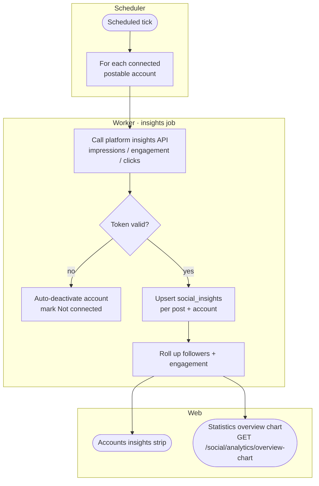
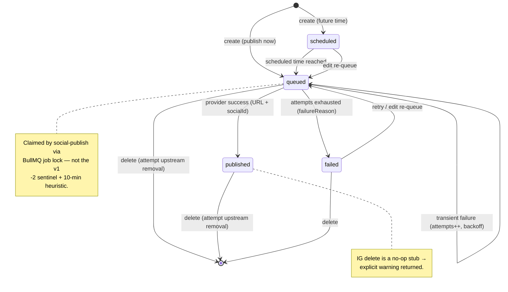

# Social — Activity / Flow Diagrams

Mermaid flow diagrams for the social domain. They render natively in GitHub and VSCode
(Mermaid preview). Actor "lanes" are modelled with subgraphs
(Operator / Web / API / Worker / Scheduler / Provider).

Pairs with [user-stories.md](./user-stories.md) and the spec at
[`../feature-spec/social.md`](../feature-spec/social.md).

Index:
1. [Connect an account (OAuth)](#1-connect-an-account-oauth-us-12)
2. [Compose & publish a post](#2-compose--publish-a-post-us-21-22)
3. [Async publish via the social-publish queue](#3-async-publish-via-the-social-publish-queue-us-22-24)
4. [Schedule via the content planner calendar](#4-schedule-via-the-content-planner-calendar-us-32)
5. [Content-planner drip campaign](#5-content-planner-drip-campaign-us-41)
6. [Auto-share a review](#6-auto-share-a-review-us-26)
7. [Insights pull](#7-insights-pull-us-52)
8. [Post status state machine](#8-post-status-state-machine)
9. [Browse / filter the timeline + edit / delete / retry](#9-browse--filter-the-timeline--edit--delete--retry-us-31-us-23-25)
10. [Campaign history & cancel](#10-campaign-history--cancel-us-42-44)

---

## 1. Connect an account (OAuth) (US-1.2)



---

## 2. Compose & publish a post (US-2.1, US-2.2)



---

## 3. Async publish via the social-publish queue (US-2.2–2.4)



---

## 4. Schedule via the content planner calendar (US-3.2)



---

## 5. Content-planner drip campaign (US-4.1)

```mermaid
flowchart TD
    subgraph Operator
        A([Open /social/content-planner/create]) --> B[Pick preset + duration\n+ platforms + min rating\n+ style params + description]
        B --> C[postsToSchedule =\ndates × platforms]
        C --> D[Submit]
    end
    subgraph API[API · social/campaigns]
        D --> E[Scope to profileId]
        E --> F[Select N un-posted reviews\nscore ≥ min_rating,\nnot in a pending campaign]
        F --> G[Create social_campaigns row\nUUID match /^[a-f0-9]{16}$/]
        G --> H[Create social_campaign_posts:\none per review × social\nwith scheduleDate from preset×range]
        H -- text errors --> I[[422 messages keyed by platform]]
        H --> J[Enqueue post-automator job]
        J --> K[[201 created]]
    end
    subgraph Worker[Worker · post-automator queue]
        K --> L[Generate branded testimonial\nper campaign post]
        L --> M[Hand off to social-publish\nat each scheduleDate → diagram #3]
        M --> N[Update processed / rate]
    end
    K --> O([Redirect to campaign history])
```

---

## 6. Auto-share a review (US-2.6)

```mermaid
flowchart TD
    subgraph Operator
        A([Open testimonial composer\n?review=id]) --> B[Pick platforms\n+ style params + description tokens]
        B --> C[Live iframe preview]
        C --> D{Schedule?}
        D -- no --> E[Post now]
        D -- yes --> F[Pick datetime]
        E --> G[Share]
        F --> G
    end
    subgraph API[API · reviews share → social publisher]
        G --> H[Step 1: render image\nGET /reviews/:id/image?params\ncache it]
        H --> I[Step 2: POST /reviews/:id/share\nsocials, reviewMessage, params]
        I --> J[Replace tokens\nlink / rating / platform / page]
        J --> K[Insert social_posts rows\nstatus = queued]
        K --> L[Enqueue social-publish]
        L --> M[[published[] , failed{}]]
    end
    M --> N([Per-platform success / error toasts])
```

> Auto-share opt-out platforms live in `platform_whitelist` (a *deactivated* list — rename in v2).

---

## 7. Insights pull (US-5.2)



> Schema gap: `social_insights` has **no v1 source** — define metrics, source APIs, and cadence first.

---

## 8. Post status state machine



> Open question: v2 normalizes v1's bit-sum statuses (`-1/0/1/-2`) into the explicit enum
> `failed/queued/scheduled/published`; campaign posts mirror their post status back into
> `social_campaign_posts` on publish/delete.

---

## 9. Browse / filter the timeline + edit / delete / retry (US-3.1, US-2.3–2.5)

```mermaid
flowchart TD
    subgraph Web[Timeline /social]
        A([Open /social]) --> B[GET /social/posts\npage, query, status[], platforms[], dates[]]
        F[Change a filter] -->|debounced ~1s, page→1| B
        S[Scroll to bottom] -->|page < pages| B
        V[Toggle List/Grid] -->|cookie| R
    end
    subgraph API
        B --> C[Scope to profileId]
        C --> D[Explicit enum filter\n failed/queued/scheduled/published\n NOT v1 bit-sum]
        D --> E[Order by schedule ?? createdAt DESC, paginate]
        E --> R[Render cards / skeleton / empty 'No posts']
    end
    subgraph Operator
        R --> G{Row action?}
        G -->|Edit| H[Open Edit modal\n status in queued/scheduled/failed\n platform immutable]
        H --> H1[PUT /social/posts/:id\n re-validate + re-queue → diagram #3]
        G -->|Delete| I[Confirm → DELETE /social/posts/:id]
        I --> I1{published & still connected?}
        I1 -- yes --> I2[Attempt upstream removal\n IG = no-op → warning]
        I1 -- no --> I3[Remove from Oggvo only]
        G -->|Retry failed| J[POST /social/posts/:id/retry\n status→queued, clear failureReason]
        J --> H1
    end
```

> Edit/Retry are spec-authoritative (§3–§5); the v1 post card surfaced only View + Delete — confirm the v1 surface when porting.

---

## 10. Campaign history & cancel (US-4.2, 4.4)

```mermaid
flowchart TD
    subgraph Web[Content planner]
        A([Open /social/content-planner]) --> B[GET /social/campaigns?status=&page=]
        B --> C[Status TabBar:\n all/Generating/Running/Completed/Cancelled]
        C --> D[Table: id, date, status,\n processed/total, rate% progress]
        D --> E{Row action?}
        E -->|Browse Posts| F([/social/content-planner/:uuid\n grouped, read-only])
        E -->|Cancel| G[Confirm modal]
    end
    subgraph API
        G --> H[DELETE /social/campaigns/:uuid\n uuid matches /^[a-f0-9]{16}$/]
        H --> I[status → cancelled]
        I --> J[Delete queued social_posts rows]
        J --> K[Mirror statuses back to\n social_campaign_posts]
    end
    K --> L([Row badge → Cancelled])
```

> v1 quirk: the cancel modal is titled "Delete Post" and toasts "campaigns deleted successfully!" — normalize the copy in v2.
