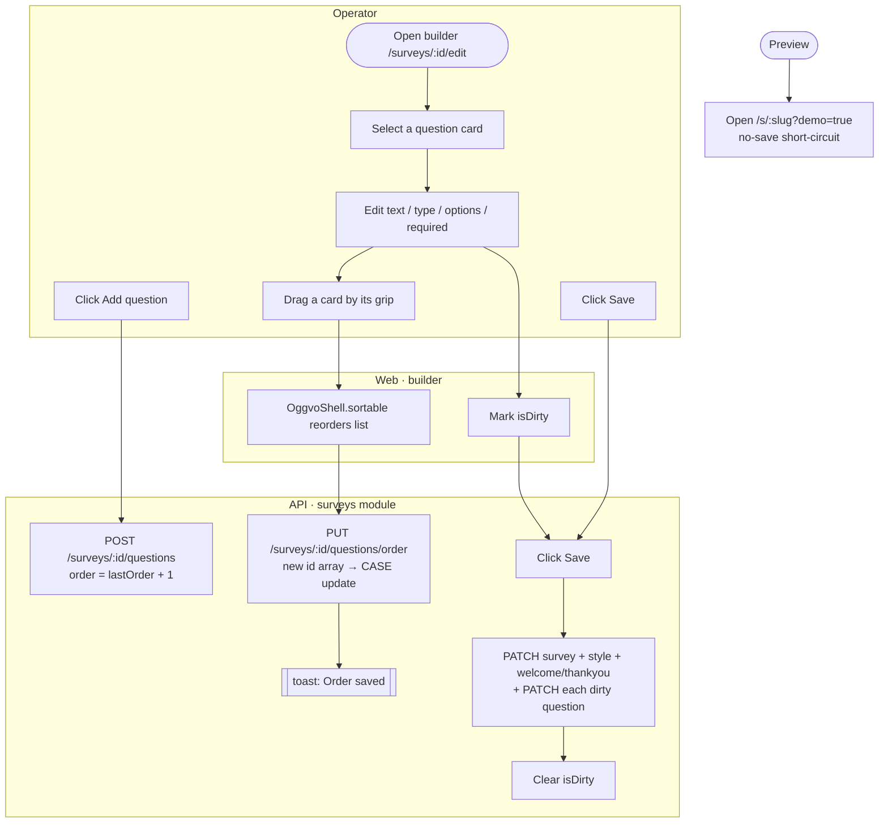
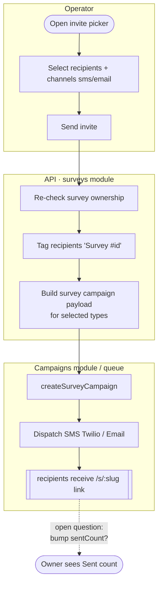
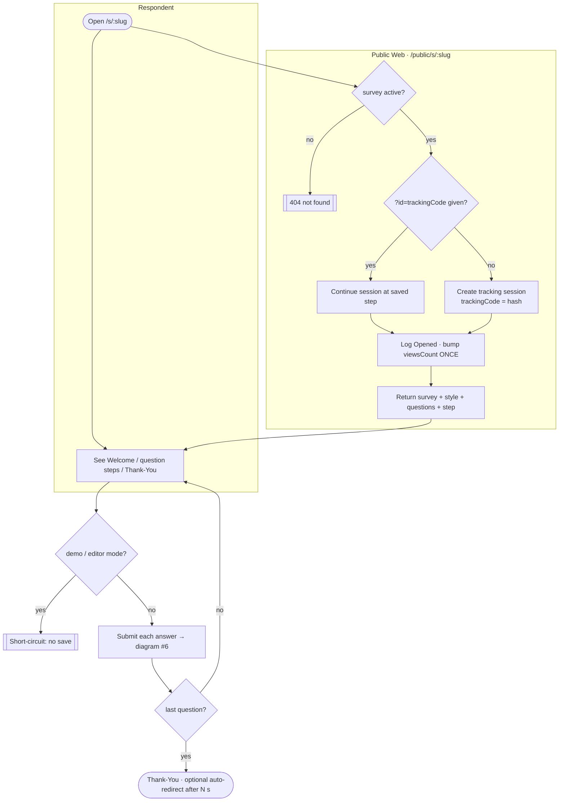
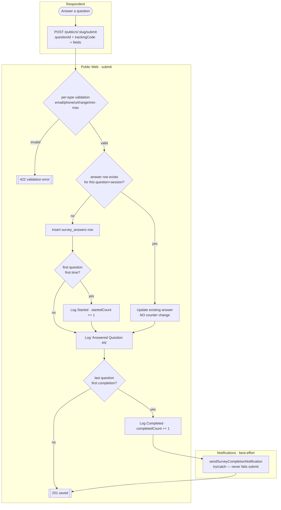
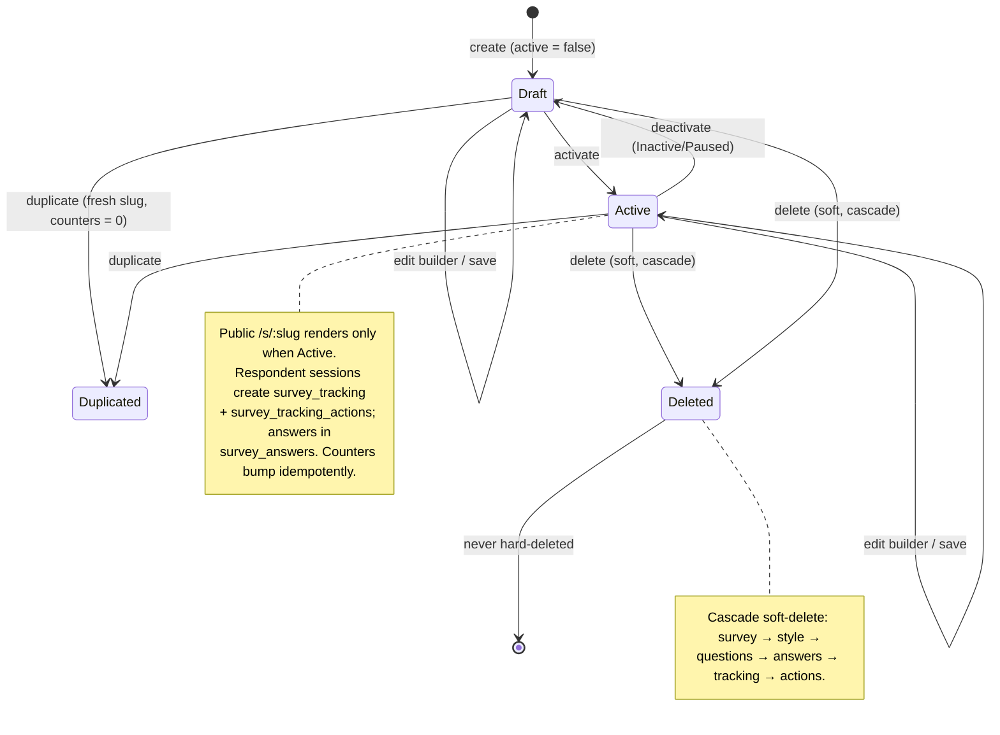

# Surveys — Activity / Flow Diagrams

Mermaid flow diagrams for the surveys domain. They render natively in GitHub and VSCode
(Mermaid preview). Actor "lanes" are modelled with subgraphs
(Operator / Web / API / Public Web / Respondent / Campaigns / Notifications).

Pairs with [user-stories.md](./user-stories.md) and the spec at
[`../feature-spec/surveys.md`](../feature-spec/surveys.md).

Index:
1. [Create a survey](#1-create-a-survey-us-14)
2. [Build & reorder questions](#2-build--reorder-questions-us-21-25)
3. [Browse / search / filter the list](#3-browse--search--filter-us-11-13)
4. [Invite contacts (campaigns hand-off)](#4-invite-contacts-us-32)
5. [Public respondent flow](#5-public-respondent-flow-us-41-42)
6. [Response capture & counters](#6-response-capture--counters-us-42)
7. [Results aggregation](#7-results-aggregation-us-51)
8. [Survey lifecycle state machine](#8-survey-lifecycle-state-machine)

---

## 1. Create a survey (US-1.4)

```mermaid
flowchart TD
    subgraph Operator
        A([Click Create Survey]) --> B[Enter title + optional description]
        B --> C[Submit modal]
    end
    subgraph API[API · surveys module]
        C --> D{title present?}
        D -- no --> E[[422 field error]]
        D -- yes --> F[Generate unique slug\nrandom prefix + slugified title]
        F --> G[Insert survey\nactive = false, counters = 0]
        G --> H[Seed survey_style row\nprogressColor = #2E90FA]
        H --> I[[201 created · {id}]]
    end
    E -.-> B
    I --> J([Redirect /surveys/:id/edit])
```

---

## 2. Build & reorder questions (US-2.1–2.5)



---

## 3. Browse / search / filter (US-1.1–1.3)

```mermaid
flowchart LR
    subgraph Web
        A([Load /surveys]) --> B[Read params from URL]
        B --> C[GET /surveys?page,q,status]
        I[User types search] -->|debounced, page→1| C
        J[User toggles status filter] -->|page→1| C
    end
    subgraph API
        C --> D[Scope to profileId\ndeletedAt IS NULL]
        D --> E{q present?}
        E -- yes --> F[Match title / description]
        E -- no --> G[All in scope]
        F --> H
        G --> H[Apply status filter]
        H --> K[Sort createdAt desc\n+ offset paginate 10/pg]
        K --> L[[data[], page, total, pages]]
    end
    L --> M[Render table / skeleton / empty state]
```

---

## 4. Invite contacts (US-3.2)



---

## 5. Public respondent flow (US-4.1–4.2)



> Fix-on-rebuild: `viewsCount` is bumped exactly once (v1 double-bumped in the anonymous branch).

---

## 6. Response capture & counters (US-4.2)



> Fix-on-rebuild (BF-011): counter bumps are idempotent — re-answers update in place, demo mode never writes.

---

## 7. Results aggregation (US-5.1)

```mermaid
flowchart LR
    subgraph Operator
        A([Open /surveys/:id/results]) --> B[Optionally pick date range]
    end
    subgraph API[API · surveys service]
        B --> C[GET /surveys/:id/results?start_date,end_date]
        C --> D[Scope to profileId · 404 if not owned]
        D --> E[Compute stats strip\nViews / Started / Completed /\nAbandoned = Started − Completed /\nCompletion = floor C*100/S]
        E --> F[For each question:]
        F --> G{aggregable type?}
        G -- yes --> H[Set-based GROUP BY in SQL:\noption → votes, rate %]
        G -- no --> I[Count N responses\n+ sample text answers]
        H --> J
        I --> J[Assemble per-question blocks]
        J --> K[[stats + questions[].answers]]
    end
    K --> L[Render KPI cards + bar/rating charts]
```

> Fix-on-rebuild: date range was sent backwards in v1; aggregation is set-based (no per-answer PHP loops),
> and the MultipleChoice total is computed once.

---

## 8. Survey lifecycle state machine


