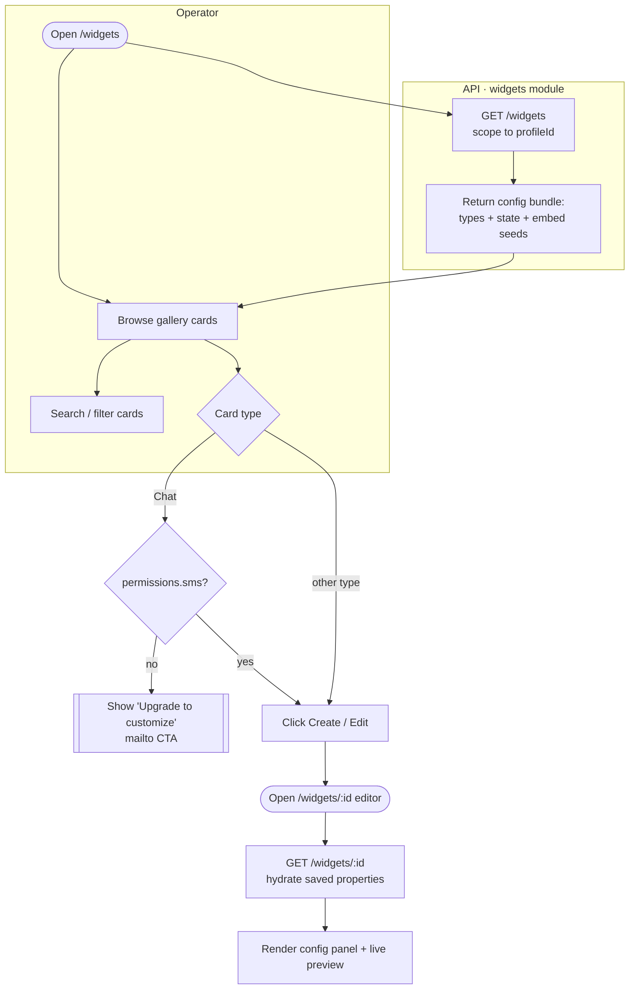
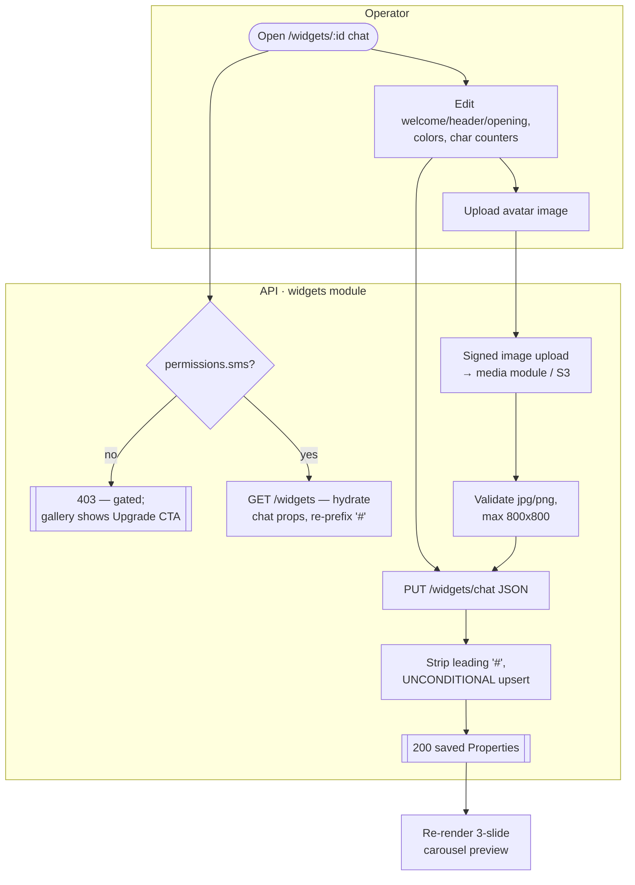
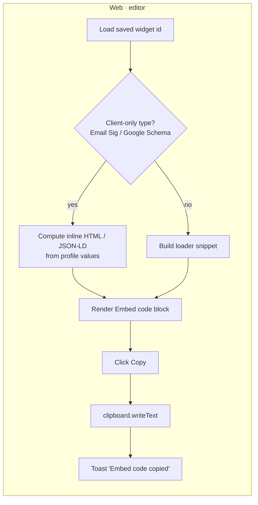
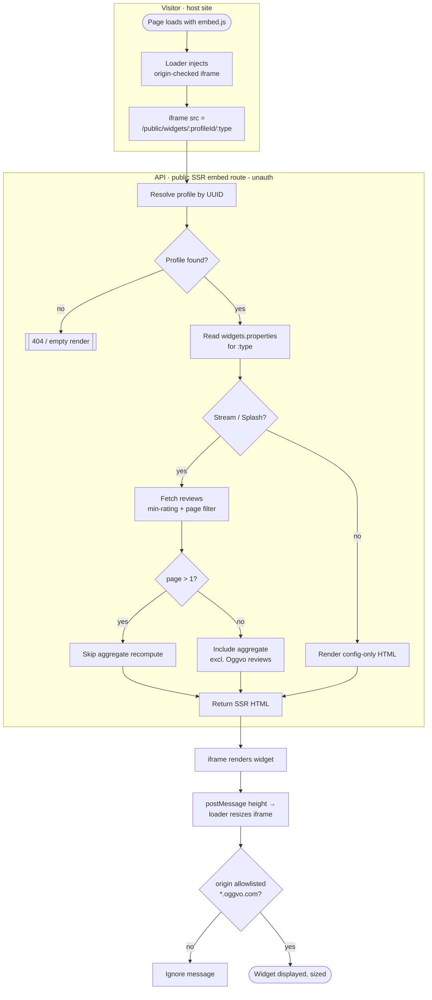

# Widgets — Activity / Flow Diagrams

Mermaid flow diagrams for the widgets domain. They render natively in GitHub and VSCode
(Mermaid preview). Actor "lanes" are modelled with subgraphs (Operator / Visitor / Web / API /
SSR-Embed / Worker).

Pairs with [user-stories.md](./user-stories.md) and the spec at
[`../feature-spec/widgets.md`](../feature-spec/widgets.md).

Index:
1. [Create / pick a widget](#1-create--pick-a-widget-us-11-us-21)
2. [Configure a widget style (auto-save + preview)](#2-configure-a-widget-style-us-22-us-25)
3. [Configure the SMS-gated Chat widget](#3-configure-the-sms-gated-chat-widget-us-24)
4. [Generate & copy the embed snippet](#4-generate--copy-the-embed-snippet-us-31)
5. [Public widget render / data fetch](#5-public-widget-render--data-fetch-us-41)
6. [Chat-widget inquiry submission](#6-chat-widget-inquiry-submission-us-42)

---

## 1. Create / pick a widget (US-1.1, US-2.1)



---

## 2. Configure a widget style (US-2.2, US-2.5)

```mermaid
flowchart TD
    subgraph Operator
        A([Change a control:\nmax reviews / min rating /\nlayout / color / switch / autoplay])
    end
    subgraph Web[Web · editor]
        A --> B[Optimistic update\nof local config]
        B --> C[Re-render live preview]
        B --> D[PUT /widgets/:id\n{ type, properties }]
    end
    subgraph API[API · widgets service]
        D --> E[Scope to profileId]
        E --> F{Valid properties\nfor this widgetType?}
        F -- no --> G[[422 field errors]]
        F -- yes --> H[Upsert on\n(profileId, widgetType)\nproperties JSONB]
        H --> I[[200 saved row]]
    end
    G -.-> B
    I --> J[Toast 'Saved' +\nrefresh embed string]
```

> Fix-on-rebuild: the upsert writes only the `widgets` row — it never mutates the whole profile.

---

## 3. Configure the SMS-gated Chat widget (US-2.4)



> Fix-on-rebuild: unconditional upsert (no no-op-on-defaults); image to S3, not local disk.

---

## 4. Generate & copy the embed snippet (US-3.1)



> Fix-on-rebuild: always emit absolute CDN URLs — never relative `/widget/…` paths.

---

## 5. Public widget render / data fetch (US-4.1)



---

## 6. Chat-widget inquiry submission (US-4.2)

```mermaid
flowchart TD
    subgraph Visitor
        A([Open chat widget]) --> B[Fill name, phone, message]
        B --> C[reCAPTCHA v3 executes\naction 'Chat']
        C --> D[Submit]
    end
    subgraph API[API · public inquiries - unauth]
        D --> E[POST /public/widgets/:profileId/inquiries]
        E --> F{ProfileID UUID +\nname>=1 + msg>=10 valid?}
        F -- no --> G[[422 field errors]]
        F -- yes --> H[Normalize phone\nlibphonenumber]
        H --> I{reCAPTCHA v3\nverified server-side?}
        I -- no --> J[[Reject — no thread created]]
        I -- yes --> K[Enqueue messaging job]
    end
    subgraph Worker[Worker · messaging queue]
        K --> L{Existing thread\nprofile + phone?}
        L -- yes --> M[Append to thread\nsource = inquiry]
        L -- no --> N[Create thread\nsource = inquiry]
        M --> O[Notify owner via SMS path\n- connect-messaging domain]
        N --> O
    end
    O --> P[[200 { status: true }]]
    P --> Q([Widget shows thank-you slide])
    G -.-> B
    J -.-> B
```

> Fix-on-rebuild: reCAPTCHA always verified; inquiry work runs on the messaging queue, not inline.
